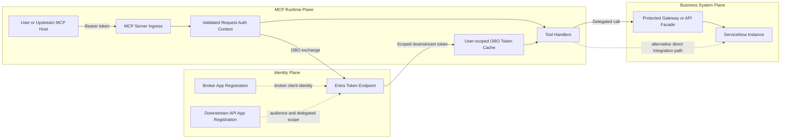
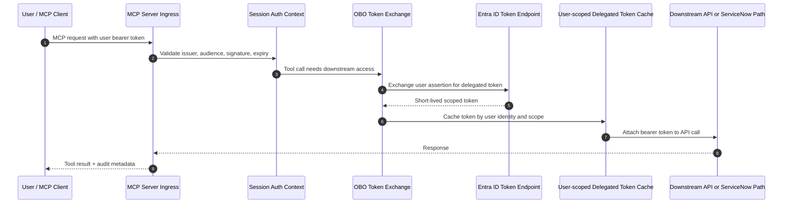
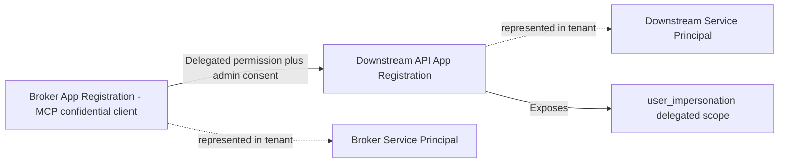

# ServiceNow MCP Server

[](https://opensource.org/licenses/MIT)

A Model Context Protocol (MCP) server that interfaces with ServiceNow, allowing AI agents to access and manipulate ServiceNow data through a secure API using explicit MCP tools and resources.

## Features

### Resources

- `servicenow://incidents`: List recent incidents
- `servicenow://incidents/{number}`: Get a specific incident by number
- `servicenow://users`: List users
- `servicenow://knowledge`: List knowledge articles
- `servicenow://tables`: List available tables
- `servicenow://tables/{table}`: Get records from a specific table
- `servicenow://schema/{table}`: Get the schema for a table

### Tools

#### Basic Tools
- `create_incident`: Create a new incident
- `update_incident`: Update an existing incident
- `search_records`: Search for records using text query
- `get_record`: Get a specific record by sys_id
- `perform_query`: Perform a query against ServiceNow
- `add_comment`: Add a comment to an incident (customer visible)
- `add_work_notes`: Add work notes to an incident (internal)

#### Script Management Tool
- `update_script`: Update ServiceNow script files (script includes, business rules, etc.)

## Installation

This repository is currently supported as a source checkout only.

### From Source

```bash
git clone https://github.com/drewelewis/ai-servicenow-mcp-obo.git
cd ai-servicenow-mcp-obo
pip install -e .
```

Notes:

1. Do not use the original upstream repository URL for this fork's OBO-specific changes.
2. Do not rely on a PyPI package for this repo's current feature set.
3. On Windows, you can also use the provided helper scripts for local setup: `_env_create.bat`, `_env_activate.bat`, and `_install.bat`.

## Getting Started

This project requires identity and ServiceNow configuration beyond a simple clone-and-run flow.

Use the runbook below for first-time setup.

### Prerequisites

1. Python 3.10+ available on PATH.
2. ServiceNow instance admin access for OAuth/JWT object setup.
3. Azure CLI (`az`) installed and authenticated if you plan to use Entra bootstrap automation.
4. Ability to complete interactive Entra sign-in (browser popup or device code).

### Step 1: Clone and Create Local Environment

```bash
git clone https://github.com/drewelewis/ai-servicenow-mcp-obo.git
cd ai-servicenow-mcp-obo
python -m venv .venv
```

Windows helper path:

```bat
_env_create.bat
_env_activate.bat
_install.bat
```

Cross-platform manual path:

```bash
pip install -e .
```

### Step 2: Choose Your Auth Pattern

1. Basic/token/OAuth direct mode:
  - Quickest path for legacy or static credentials.
2. Entra OBO mode:
  - For delegated user token exchange in Entra.
3. ServiceNow JWT bearer bridge mode (recommended for delegated access in this tenant):
  - Validates incoming Entra user token, then exchanges signed JWT assertion at ServiceNow oauth_token.do.

For full architecture comparison and diagrams of OBO options, see [obo-flow-options.md](obo-flow-options.md).

### Step 3: Bootstrap Identity/App Config (If Using OBO/JWT Delegation)

Generate Entra app registrations and env output:

```powershell
az login
.\scripts\bootstrap-entra-obo.ps1 -OutputEnvFile ".env.obo.generated"
```

Merge generated values into your runtime env:

```powershell
.\scripts\apply-obo-env.ps1 -SourceEnvFile ".env.obo.generated" -TargetEnvFile ".env"
```

### Step 4: Configure ServiceNow JWT Objects (If Using JWT Bearer Bridge)

1. Generate key material and JWKS (if not already created):

```bash
python scripts/bootstrap_servicenow_jwt.py generate-key-material
python scripts/bootstrap_servicenow_jwt.py generate-jwks
```

2. Build payload templates for ServiceNow OAuth/JWT records:

```bash
python scripts/bootstrap_servicenow_jwt.py build-payload-templates --jwks-url "<public-jwks-url>"
```

3. Provision/validate ServiceNow records (`oauth_jwt`, `oauth_entity`, `oauth_entity_profile`) and ensure a matching `sys_user` exists for the delegated identity claim value.

### Step 5: Validate End-to-End Before Running MCP Clients

Run the repeatable delegated smoke test:

```bash
python scripts/smoke_test_sn_jwt.py --show-claims
```

This validates:

1. Entra user token acquisition.
2. ServiceNow JWT bearer token exchange.
3. Incident table API call through MCP auth path.

### Step 6: Start the MCP Server

```bash
python -m mcp_server_servicenow.cli --transport stdio
```

Windows shortcut:

```bat
_start_mcp_server.bat
```

### First-Run Troubleshooting Checklist

1. `oauth_token.do` returns 401/400:
  - Query ServiceNow syslog entries from `com.glide.ui.ServletErrorListener` for real cause.
2. `invalid_grant` with `User not found`:
  - Ensure ServiceNow `sys_user` exists for the claim configured in JWT user mapping.
3. OBO setup appears complete but flow still fails:
  - Re-run bootstrap scripts and re-merge `.env` values.
  - Verify `.env` does not contain stale client IDs or rotated secrets.

## Usage

### Command Line

Run the server using the Python module.

Choose one authentication mode per deployment.

#### Usage: Basic Auth

Compatibility path only. Use this only if your ServiceNow tenant still allows direct username/password authentication.

Command-line example:

```bash
python -m mcp_server_servicenow.cli --url "https://your-instance.service-now.com/" --username "your-username" --password "your-password"
```

Environment-variable example:

```bash
export SERVICENOW_INSTANCE_URL="https://your-instance.service-now.com/"
export SERVICENOW_USERNAME="your-username"
export SERVICENOW_PASSWORD="your-password"
python -m mcp_server_servicenow.cli
```

Windows PowerShell example:

```powershell
$env:SERVICENOW_INSTANCE_URL="https://your-instance.service-now.com/"
$env:SERVICENOW_USERNAME="your-username"
$env:SERVICENOW_PASSWORD="your-password"
python -m mcp_server_servicenow.cli
```

#### Usage: Bearer Token

Use this mode when you already have a valid ServiceNow bearer token and want the server to reuse it directly.

Command-line example:

```bash
python -m mcp_server_servicenow.cli --url "https://your-instance.service-now.com/" --token "<servicenow-access-token>"
```

Environment-variable example:

```bash
export SERVICENOW_INSTANCE_URL="https://your-instance.service-now.com/"
export SERVICENOW_TOKEN="<servicenow-access-token>"
python -m mcp_server_servicenow.cli
```

#### Usage: ServiceNow OAuth

Use this mode when ServiceNow itself is the resource server and your tenant does not permit basic auth or you want a stronger direct-auth pattern.

Command-line example:

```bash
python -m mcp_server_servicenow.cli \
  --url "https://your-instance.service-now.com/" \
  --client-id "<servicenow-oauth-client-id>" \
  --client-secret "<servicenow-oauth-client-secret>" \
  --username "<servicenow-username>" \
  --password "<servicenow-password>"
```

Environment-variable example:

```bash
export SERVICENOW_INSTANCE_URL="https://your-instance.service-now.com/"
export SERVICENOW_CLIENT_ID="<servicenow-oauth-client-id>"
export SERVICENOW_CLIENT_SECRET="<servicenow-oauth-client-secret>"
export SERVICENOW_USERNAME="<servicenow-username>"
export SERVICENOW_PASSWORD="<servicenow-password>"
python -m mcp_server_servicenow.cli
```

#### Usage: Entra OBO

Use OBO when your upstream caller provides a user bearer token and you want delegated downstream access.

Command-line example:

```bash
python -m mcp_server_servicenow.cli \
  --url "https://your-instance.service-now.com/" \
  --obo-tenant-id "<tenant-guid>" \
  --obo-client-id "<broker-app-client-id>" \
  --obo-client-secret "<broker-app-client-secret>" \
  --obo-scope "api://<downstream-app-id>/.default"
```

Environment-variable example:

```bash
export SERVICENOW_INSTANCE_URL="https://your-instance.service-now.com/"
export SERVICENOW_OBO_TENANT_ID="<tenant-guid>"
export SERVICENOW_OBO_CLIENT_ID="<broker-app-client-id>"
export SERVICENOW_OBO_CLIENT_SECRET="<broker-app-client-secret>"
export SERVICENOW_OBO_SCOPE="api://<downstream-app-id>/.default"
python -m mcp_server_servicenow.cli
```

Windows PowerShell example:

```powershell
$env:SERVICENOW_INSTANCE_URL="https://your-instance.service-now.com/"
$env:SERVICENOW_OBO_TENANT_ID="<tenant-guid>"
$env:SERVICENOW_OBO_CLIENT_ID="<broker-app-client-id>"
$env:SERVICENOW_OBO_CLIENT_SECRET="<broker-app-client-secret>"
$env:SERVICENOW_OBO_SCOPE="api://<downstream-app-id>/.default"
python -m mcp_server_servicenow.cli
```

#### Auth Selection Rules

1. OBO and basic auth are both supported, but they are separate auth modes.
2. If complete OBO settings are present, the CLI selects OBO.
3. If OBO is not configured, the CLI can fall back to token auth, OAuth, or basic username/password.
4. Do not assume `--username` and `--password` are combined with OBO; they are used for the non-OBO auth paths.

### Interactive CLI Helper

If you want a quick local script that runs a menu of common MCP operations using your configured `.env` auth settings, use:

```bash
python scripts/interactive_mcp_client.py
```

To print the supported command list without starting interactive mode:

```bash
python scripts/interactive_mcp_client.py --list-commands
```

This helper supports the same non-basic auth configuration patterns as the CLI (OBO, bearer token, or ServiceNow OAuth).

For local OBO testing, if `SERVICENOW_OBO_USER_ASSERTION` is unset/placeholder, the helper can auto-acquire a user assertion token via interactive Entra sign-in (browser popup with MFA).

- optional `SERVICENOW_OBO_PUBLIC_CLIENT_ID` (defaults to `SERVICENOW_OBO_CLIENT_ID`)
- optional `SERVICENOW_OBO_USER_SCOPE` (defaults to `<SERVICENOW_OBO_CLIENT_ID>/.default` GUID-based scope)
- optional `SERVICENOW_OBO_ALLOW_DEVICE_CODE_FALLBACK=true` to allow device-code flow when popup sign-in is unavailable

This simulates the incoming user bearer token a Teams-like client would normally pass to the MCP server.

### Repeatable ServiceNow JWT Smoke Test

Use the dedicated smoke test script to validate the complete delegated JWT bearer path end-to-end with one command.

Script path:

- `scripts/smoke_test_sn_jwt.py`

Run:

```bash
python scripts/smoke_test_sn_jwt.py --show-claims
```

What it verifies:

1. Device-code sign-in and Entra user token acquisition.
2. ServiceNow oauth_token.do JWT bearer exchange.
3. ServiceNow incident table query through MCP server auth path.

### OBO Flow Options and Architecture Breakdown

For a complete breakdown of both delegated auth patterns, tradeoffs, and architecture diagrams, see:

- [obo-flow-options.md](obo-flow-options.md)

### MCP Explorer (Inspector) Quick Start

If you are using this repository scripts on Windows:

1. Create and activate the virtual environment.
2. Copy `.env.example` to `.env` and fill in your ServiceNow credentials.
3. Install dependencies.
4. Start MCP Explorer.

```bat
_env_create.bat
_env_activate.bat
copy .env.example .env
_install.bat
_start_mcp_explorer.bat
```

Stop MCP Explorer when done:

```bat
_stop_mcp_explorer.bat
```

Why this matters: `_start_mcp_explorer.bat` launches `python -m mcp_server_servicenow.cli`, which loads values from `.env` automatically.

### Configuration in Cline

To use this MCP server with Cline, add args for the auth mode you actually intend to run. Example below shows the basic-auth variant only.

```json
{
  "mcpServers": {
    "servicenow": {
      "command": "/path/to/your/python/executable",
      "args": [
        "-m",
        "mcp_server_servicenow.cli",
        "--url", "https://your-instance.service-now.com/",
        "--username", "your-username",
        "--password", "your-password"
      ],
      "disabled": false,
      "autoApprove": []
    }
  }
}
```

**Note:** Make sure to use the full path to the Python executable that has the `mcp-server-servicenow` package installed.

## Troubleshooting Startup

- `Error: ServiceNow instance URL is required`
  - Set `SERVICENOW_INSTANCE_URL` in your environment, or create `.env` from `.env.example`.
- `Error: Authentication credentials required`
  - Provide one supported auth method in `.env` (basic auth, token, or OAuth values).
- `npx was not found`
  - Install Node.js so `npx` is available in `PATH`.

- `AADSTS399274: application is configured for SAML SSO and could not be used with non-SAML protocol`
  - The OBO downstream resource in `SERVICENOW_OBO_SCOPE` points to a SAML-only enterprise app.
  - Use an OAuth/OIDC-capable resource app scope (for example `api://<app-id>/.default`) for OBO token exchange.
  - If you need direct ServiceNow API acceptance, configure ServiceNow to trust Entra-issued OAuth/OIDC bearer tokens for the chosen audience; SAML-only app registrations cannot be used for OBO token issuance.

## Tool Usage Examples

Use explicit tool inputs for all operations. For searching and updates, call `search_records`, `perform_query`, `update_incident`, `add_comment`, and `add_work_notes` directly with structured arguments.

### Managing Scripts

You can update ServiceNow scripts from local files:

```
Update the ServiceNow script include "HelloWorld" with the contents of hello_world.js
Upload utils.js to ServiceNow as a script include named "UtilityFunctions"
Update @form_validation.js, it's a client script called "FormValidation"
```

## Authentication Methods

The server supports multiple authentication methods, but they are not equally appropriate for every ServiceNow environment.

1. **Basic Authentication**
  - Uses `--username` and `--password`.
  - Best treated as compatibility-only because many ServiceNow tenants disable or discourage it.
2. **Bearer Token Authentication**
  - Uses `--token`.
  - Useful when you already have a valid ServiceNow access token outside this process.
3. **ServiceNow OAuth Authentication**
  - Uses `--client-id`, `--client-secret`, `--username`, and `--password`.
  - This is the direct OAuth path where ServiceNow is the resource server.
4. **Entra OBO Authentication**
  - Uses `--obo-*` settings.
  - This is the delegated Entra identity path and is architecturally different from native ServiceNow OAuth.

### Recommended Auth Mode By Scenario

1. **You need the simplest local compatibility setup and your tenant still permits it**
  - Use Basic Authentication.
2. **You already have a valid ServiceNow bearer token**
  - Use Bearer Token Authentication.
3. **You want direct modern auth to ServiceNow**
  - Use ServiceNow OAuth Authentication.
4. **You need delegated per-user identity from Entra or an upstream enterprise caller**
  - Use Entra OBO Authentication.

### Entra OBO Setup

Use OBO when you want per-user delegated access instead of storing static ServiceNow credentials.

#### Architecture Overview



Read this diagram in three layers:

1. Identity plane defines who can mint and accept delegated tokens.
2. MCP runtime plane validates the incoming user, performs OBO, and executes tools.
3. Business system plane is where ServiceNow is ultimately reached, either directly or through a protected facade.

#### Design Check

This repository currently models an Entra-based delegated access pattern with these important boundaries:

1. The MCP server acts as the broker confidential client.
2. The incoming user token is captured from the active MCP request context and used for OBO exchange.
3. The exchanged token is meant for the configured downstream audience, not automatically for every HTTP endpoint.
4. A direct ServiceNow call only works with this pattern if the downstream target can validate the Entra-issued bearer token or is fronted by a gateway that can.

Practical implication:

- If you call ServiceNow through an Entra-protected API or gateway, the broker/downstream app-registration model fits well.
- If you call ServiceNow directly and it is not validating your Entra token as a resource audience, use one of the alternatives below instead of assuming raw OBO is enough by itself.

#### Main Components And Why They Exist

1. MCP client or upstream host:
  - Originates the request on behalf of a signed-in user.
  - Supplies the user assertion token that anchors delegated identity.
2. MCP server ingress:
  - Receives the MCP request and extracts transport auth metadata.
  - Prevents tool execution from running without an authenticated caller context.
3. Request auth context:
  - Holds the current request's user assertion in request-scoped state.
  - Prevents one user's delegated token flow from being sourced from another request.
4. Broker app registration:
  - Represents this MCP server as a confidential Entra client.
  - Is required so the server can perform the OBO token exchange.
5. Entra token endpoint:
  - Exchanges the upstream user assertion for a scoped downstream access token.
  - Enforces tenant, consent, and delegated-permission policy.
6. Downstream API app registration:
  - Represents the resource audience the broker is requesting access to.
  - Exposes the delegated scope that the broker asks for during OBO.
7. Service principals:
  - Materialize both app registrations inside the tenant.
  - Are required for consent, policy enforcement, and enterprise administration.
8. Downstream connector target:
  - Is the actual HTTP target that receives the delegated bearer token.
  - In this design, that target should be an Entra-protected API, gateway, or another resource that trusts the issued token.
9. ServiceNow instance:
  - Remains the system of record for incidents, tables, scripts, and user-facing operations.
  - May be reached directly, or indirectly through a gateway or facade depending on the auth pattern you choose.

#### Where Each Component Sits In The Design

- Identity plane:
  - Broker app registration, downstream app registration, service principals, Entra token endpoint.
- MCP runtime plane:
  - MCP client, MCP server ingress, request auth context, tool handlers.
- Business system plane:
  - Downstream connector target and the ServiceNow instance.

Production note:

- The current implementation validates incoming Entra bearer tokens for signature, issuer, audience, and expiry before OBO exchange.
- The current implementation also keeps delegated tokens in a user-scoped in-memory cache keyed by validated identity plus downstream scope and token endpoint.
- Broader production hardening remains tracked in [todo.md](todo.md), including policy refinement, retry behavior, and full conformance coverage.

#### MCP OBO Flow



Flow summary:

1. The MCP request carries the user assertion.
2. The server validates identity and binds it to a session context.
3. The server performs OBO exchange for downstream scoped access.
4. The delegated token is cached per user and downstream scope until near expiry.
5. Result metadata is returned to the caller.

#### Fully Scriptable Entra Bootstrap

This repository now includes a script that creates everything needed in Entra for OBO and prints the exact `.env` values for this server.

Purpose of the Entra registrations:

1. Broker app registration:
  - Represents this MCP server as a confidential client.
  - Accepts the incoming user assertion and performs OBO token exchange.
2. Downstream API app registration:
  - Represents the resource API audience for delegated access.
  - Exposes the delegated scope (for example, `user_impersonation`) that the broker requests.
3. Service principals:
  - Materialize both app registrations in your tenant so permissions and consent can be enforced.
4. Delegated permission + admin consent:
  - Grants the broker app permission to request downstream delegated tokens for signed-in users.
  - Ensures OBO calls are authorized by policy instead of static shared credentials.

Registration relationship (quick view):



#### When This Design Is The Right Fit

Use this brokered OBO design when all of the following are true:

1. Your upstream caller already authenticates users with Entra ID.
2. You need per-user delegated authorization, not a shared integration identity.
3. Your downstream API can validate the Entra token directly, or is fronted by a gateway that can.

Optional validation configuration:

- `SERVICENOW_OBO_EXPECTED_AUDIENCE`: comma-separated allowed audiences for incoming bearer tokens. Defaults to the broker app client ID.
- `SERVICENOW_OBO_EXPECTED_ISSUER`: comma-separated allowed issuers for incoming bearer tokens. Defaults to Entra tenant issuers for the configured tenant.

#### Potential Alternatives

1. Direct ServiceNow basic auth:
  - Simplest setup.
  - Uses a shared integration identity, so it does not preserve end-user authorization boundaries.
2. Direct ServiceNow OAuth with a shared service account:
  - Better secret hygiene than basic auth.
  - Still behaves like app-owned access unless you build separate per-user token handling.
3. ServiceNow-native per-user OAuth:
  - Best fit when ServiceNow itself is the true resource server and must authorize each user directly.
  - More operationally complex because you manage ServiceNow OAuth trust and user-consent flows instead of Entra OBO alone.
4. Entra-protected gateway or facade in front of ServiceNow:
  - Best fit for this repository's current broker/downstream app-registration shape.
  - Lets the gateway validate Entra tokens, enforce policy, and then call ServiceNow with its own trusted backend mechanism.
5. App-only or client-credentials integration:
  - Useful for unattended automation or batch operations.
  - Not appropriate when you must preserve the initiating user's security boundary.

Recommended decision rule:

- If the goal is true per-user delegation into a resource that trusts Entra tokens, keep the brokered OBO design.
- If the goal is direct ServiceNow access and ServiceNow is the real authorization authority, prefer ServiceNow-native OAuth or a gateway pattern.

Script path:

- `scripts/bootstrap-entra-obo.ps1`

What the script does:

1. Creates or reuses a broker app registration (the MCP server confidential client).
2. Creates or reuses an interactive public-client app registration (for local MFA popup sign-in).
3. Creates or reuses a downstream API app registration.
4. Creates service principals for all three apps.
5. Configures an exposed delegated scope on the broker API.
6. Configures an exposed delegated scope on the downstream API.
7. Adds delegated permission from broker app to downstream API.
8. Adds delegated permission from interactive client app to broker API.
9. Attempts tenant-wide admin consent.
10. Creates/rotates a broker app client secret.
11. Writes and prints a generated env block with all required `SERVICENOW_OBO_*` values.

Prerequisites:

1. Azure CLI installed (`az`).
2. Signed in to Azure CLI (`az login`).
3. Permission to create app registrations and grant admin consent (or have an admin run consent step).

Run in PowerShell from repo root:

```powershell
# Optional: allow script execution for this session
Set-ExecutionPolicy -Scope Process -ExecutionPolicy RemoteSigned

# Sign in if needed
az login

# Run with defaults
.\scripts\bootstrap-entra-obo.ps1

# Or run with explicit names/tenant
.\scripts\bootstrap-entra-obo.ps1 `
  -TenantId "<tenant-guid>" `
  -BrokerAppName "servicenow-mcp-obo-broker" `
  -InteractiveClientAppName "servicenow-mcp-obo-interactive-client" `
  -BrokerScopeName "user_impersonation" `
  -DownstreamApiAppName "servicenow-mcp-obo-downstream-api" `
  -DownstreamScopeName "user_impersonation" `
  -SecretYears 1 `
  -OutputEnvFile ".env.obo.generated"
```

Expected output artifacts:

1. Console output with the generated env values.
2. A file (default `.env.obo.generated`) containing:
   - `SERVICENOW_OBO_TENANT_ID`
   - `SERVICENOW_OBO_CLIENT_ID`
   - `SERVICENOW_OBO_CLIENT_SECRET`
   - `SERVICENOW_OBO_SCOPE`
  - `SERVICENOW_OBO_PUBLIC_CLIENT_ID`
  - `SERVICENOW_OBO_USER_SCOPE`
   - `SERVICENOW_OBO_TOKEN_ENDPOINT`
   - `SERVICENOW_OBO_USER_ASSERTION` placeholder

Then apply those values to your `.env` used by this MCP server.

#### Merge Generated OBO Values Into .env

Use the helper script to merge generated OBO settings into your existing `.env` while preserving unrelated keys.

Script path:

- `scripts/apply-obo-env.ps1`

Run:

```powershell
# Dry run (shows which keys will be applied)
.\scripts\apply-obo-env.ps1 -SourceEnvFile ".env.obo.generated" -TargetEnvFile ".env" -WhatIfOnly

# Apply changes and create backup of .env
.\scripts\apply-obo-env.ps1 -SourceEnvFile ".env.obo.generated" -TargetEnvFile ".env"
```

Behavior:

1. Reads OBO values from the generated file.
2. Updates these keys in `.env`:
  - `SERVICENOW_OBO_TENANT_ID`
  - `SERVICENOW_OBO_CLIENT_ID`
  - `SERVICENOW_OBO_CLIENT_SECRET`
  - `SERVICENOW_OBO_SCOPE`
  - `SERVICENOW_OBO_PUBLIC_CLIENT_ID`
  - `SERVICENOW_OBO_USER_SCOPE`
  - `SERVICENOW_OBO_TOKEN_ENDPOINT`
  - `SERVICENOW_OBO_USER_ASSERTION`
  - `SERVICENOW_SN_JWT_TENANT_ID`
  - `SERVICENOW_SN_JWT_UPSTREAM_CLIENT_ID`
  - `SERVICENOW_SN_JWT_CLIENT_ID`
  - `SERVICENOW_SN_JWT_CLIENT_SECRET`
  - `SERVICENOW_SN_JWT_PRIVATE_KEY_PATH`
  - `SERVICENOW_SN_JWT_TOKEN_ENDPOINT`
  - `SERVICENOW_SN_JWT_USER_CLAIM_SOURCE`
  - `SERVICENOW_SN_JWT_SCOPE`
  - `SERVICENOW_SN_JWT_KID`
  - `SERVICENOW_SN_JWT_EXPECTED_AUDIENCE`
  - `SERVICENOW_SN_JWT_EXPECTED_ISSUER`
  - `SERVICENOW_SN_JWT_ASSERTION_TTL`
  - `SERVICENOW_SN_JWT_CACHE_SAFETY_BUFFER`
  - `SERVICENOW_SN_JWT_USER_ASSERTION`
  - `SERVICENOW_SN_JWT_ALLOW_STATIC_ASSERTION`
3. Creates timestamped backup file by default: `.env.bak-YYYYMMDD-HHMMSS`.

### Validated ServiceNow JWT Bearer Notes (This Tenant)

The following behaviors were validated during live end-to-end testing:

1. ServiceNow JWT bearer exchange and incident API calls succeed after mapping incoming Entra identity to an existing ServiceNow user.
2. ServiceNow token endpoint diagnostics are often generic; use ServiceNow syslog (`com.glide.ui.ServletErrorListener`) for root-cause errors.
3. The working ServiceNow JWT client wiring in this tenant used the ServiceNow OAuth client record that the JWT provider resolves at token exchange time.
4. A `User not found` invalid_grant from oauth_token.do was resolved by creating a matching `sys_user` for the incoming `preferred_username` claim.

Important runtime note:

- `SERVICENOW_OBO_USER_ASSERTION` is an incoming user token and should be supplied at runtime by your upstream caller/session, not hardcoded as a long-lived secret.

Set these environment variables:

```bash
SERVICENOW_INSTANCE_URL="https://your-instance.service-now.com/"
SERVICENOW_OBO_TENANT_ID="<tenant-id-guid>"
SERVICENOW_OBO_CLIENT_ID="<app-client-id>"
SERVICENOW_OBO_CLIENT_SECRET="<app-client-secret>"
SERVICENOW_OBO_SCOPE="api://<downstream-app-id>/.default"
SERVICENOW_OBO_PUBLIC_CLIENT_ID="<interactive-public-client-app-id>"
SERVICENOW_OBO_USER_SCOPE="api://<broker-app-id>/user_impersonation"
# Optional override
# SERVICENOW_OBO_TOKEN_ENDPOINT="https://login.microsoftonline.com/<tenant-id>/oauth2/v2.0/token"
# Optional local-only fallback if request transport cannot provide assertion
# SERVICENOW_OBO_ALLOW_STATIC_ASSERTION="false"
# SERVICENOW_OBO_USER_ASSERTION="<incoming-user-access-token>"
```

Then run:

```bash
python -m mcp_server_servicenow.cli --transport stdio
```

Notes:

- OBO mode is selected automatically when all required `SERVICENOW_OBO_*` values are present.
- OBO takes precedence over static token/basic auth.
- OBO uses request-bound bearer assertions by default and fails closed when assertion is missing.
- `SERVICENOW_OBO_ALLOW_STATIC_ASSERTION=true` is intended for local testing only.
- The downstream API represented by `SERVICENOW_OBO_SCOPE` must trust your Entra app and accept delegated tokens.

## Development

### Prerequisites

- Python 3.8+
- ServiceNow instance with API access

### Setting Up Development Environment

```bash
# Clone the repository
git clone https://github.com/michaelbuckner/servicenow-mcp.git
cd servicenow-mcp

# Create a virtual environment
python -m venv venv
source venv/bin/activate  # On Windows: venv\Scripts\activate

# Install development dependencies
pip install -e ".[dev]"
```

### Running Tests

```bash
pytest
```

## Contributing

Contributions are welcome! Please feel free to submit a Pull Request.

1. Fork the repository
2. Create your feature branch (`git checkout -b feature/amazing-feature`)
3. Commit your changes (`git commit -m 'Add some amazing feature'`)
4. Push to the branch (`git push origin feature/amazing-feature`)
5. Open a Pull Request

## License

This project is licensed under the MIT License - see the [LICENSE](LICENSE) file for details.
