# ServiceNow MCP Server

[](https://opensource.org/licenses/MIT)

A Model Context Protocol (MCP) server that interfaces with ServiceNow, allowing AI agents to access and manipulate ServiceNow data through a secure API using explicit MCP tools and resources.

## Features

### Resources

- `servicenow://incidents`: List recent incidents
- `servicenow://incidents/{number}`: Get a specific incident by number
- `servicenow://users`: List users
- `servicenow://knowledge`: List knowledge articles
- `servicenow://tables`: List available tables
- `servicenow://tables/{table}`: Get records from a specific table
- `servicenow://schema/{table}`: Get the schema for a table

### Tools

#### Basic Tools
- `create_incident`: Create a new incident
- `update_incident`: Update an existing incident
- `search_records`: Search for records using text query
- `get_record`: Get a specific record by sys_id
- `perform_query`: Perform a query against ServiceNow
- `add_comment`: Add a comment to an incident (customer visible)
- `add_work_notes`: Add work notes to an incident (internal)

#### Script Management Tool
- `update_script`: Update ServiceNow script files (script includes, business rules, etc.)

## Installation

### From PyPI

```bash
pip install mcp-server-servicenow
```

### From Source

```bash
git clone https://github.com/michaelbuckner/servicenow-mcp.git
cd servicenow-mcp
pip install -e .
```

## Usage

### Command Line

Run the server using the Python module:

```bash
python -m mcp_server_servicenow.cli --url "https://your-instance.service-now.com/" --username "your-username" --password "your-password"
```

Or use environment variables:

```bash
export SERVICENOW_INSTANCE_URL="https://your-instance.service-now.com/"
export SERVICENOW_USERNAME="your-username"
export SERVICENOW_PASSWORD="your-password"
python -m mcp_server_servicenow.cli
```

On Windows PowerShell:

```powershell
$env:SERVICENOW_INSTANCE_URL="https://your-instance.service-now.com/"
$env:SERVICENOW_USERNAME="your-username"
$env:SERVICENOW_PASSWORD="your-password"
python -m mcp_server_servicenow.cli
```

### MCP Explorer (Inspector) Quick Start

If you are using this repository scripts on Windows:

1. Create and activate the virtual environment.
2. Copy `.env.example` to `.env` and fill in your ServiceNow credentials.
3. Install dependencies.
4. Start MCP Explorer.

```bat
_env_create.bat
_env_activate.bat
copy .env.example .env
_install.bat
_start_mcp_explorer.bat
```

Stop MCP Explorer when done:

```bat
_stop_mcp_explorer.bat
```

Why this matters: `_start_mcp_explorer.bat` launches `python -m mcp_server_servicenow.cli`, which loads values from `.env` automatically.

### Configuration in Cline

To use this MCP server with Cline, add the following to your MCP settings file:

```json
{
  "mcpServers": {
    "servicenow": {
      "command": "/path/to/your/python/executable",
      "args": [
        "-m",
        "mcp_server_servicenow.cli",
        "--url", "https://your-instance.service-now.com/",
        "--username", "your-username",
        "--password", "your-password"
      ],
      "disabled": false,
      "autoApprove": []
    }
  }
}
```

**Note:** Make sure to use the full path to the Python executable that has the `mcp-server-servicenow` package installed.

## Troubleshooting Startup

- `Error: ServiceNow instance URL is required`
  - Set `SERVICENOW_INSTANCE_URL` in your environment, or create `.env` from `.env.example`.
- `Error: Authentication credentials required`
  - Provide one supported auth method in `.env` (basic auth, token, or OAuth values).
- `npx was not found`
  - Install Node.js so `npx` is available in `PATH`.

## Tool Usage Examples

Use explicit tool inputs for all operations. For searching and updates, call `search_records`, `perform_query`, `update_incident`, `add_comment`, and `add_work_notes` directly with structured arguments.

### Managing Scripts

You can update ServiceNow scripts from local files:

```
Update the ServiceNow script include "HelloWorld" with the contents of hello_world.js
Upload utils.js to ServiceNow as a script include named "UtilityFunctions"
Update @form_validation.js, it's a client script called "FormValidation"
```

## Authentication Methods

The server supports multiple authentication methods:

1. **Basic Authentication**: Username and password
2. **Token Authentication**: OAuth token
3. **OAuth Authentication**: Client ID, Client Secret, Username, and Password
4. **Entra OBO Authentication**: Exchange incoming user token for downstream API token

### Entra OBO Setup

Use OBO when you want per-user delegated access instead of storing static ServiceNow credentials.

#### MCP OBO Flow

```mermaid
flowchart LR
  A[User / MCP Client] -->|1. MCP request with user bearer token| B[MCP Server Ingress]
  B -->|2. Validate issuer audience signature expiry| C[Session Auth Context]
  C -->|3. Tool call needs downstream access| D[OBO Token Exchange]
  D -->|4. Exchange user assertion for delegated token| E[Entra ID Token Endpoint]
  E -->|5. Short-lived scoped token| F[Delegated Token Cache]
  F -->|6. Attach token to API call| G[ServiceNow API]
  G -->|7. Response| B
  B -->|8. Tool result + audit metadata| A
```



Flow summary:

1. The MCP request carries the user assertion.
2. The server validates identity and binds it to a session context.
3. The server performs OBO exchange for downstream scoped access.
4. The delegated token is cached per user and scope until near expiry.
5. ServiceNow is called with the delegated token, then result metadata is returned.

#### Fully Scriptable Entra Bootstrap

This repository now includes a script that creates everything needed in Entra for OBO and prints the exact `.env` values for this server.

Script path:

- `scripts/bootstrap-entra-obo.ps1`

What the script does:

1. Creates or reuses a broker app registration (the MCP server confidential client).
2. Creates or reuses a downstream API app registration.
3. Creates service principals for both apps.
4. Configures an exposed delegated scope on the downstream API.
5. Adds delegated permission from broker app to downstream API.
6. Attempts tenant-wide admin consent.
7. Creates/rotates a broker app client secret.
8. Writes and prints a generated env block with all required `SERVICENOW_OBO_*` values.

Prerequisites:

1. Azure CLI installed (`az`).
2. Signed in to Azure CLI (`az login`).
3. Permission to create app registrations and grant admin consent (or have an admin run consent step).

Run in PowerShell from repo root:

```powershell
# Optional: allow script execution for this session
Set-ExecutionPolicy -Scope Process -ExecutionPolicy RemoteSigned

# Sign in if needed
az login

# Run with defaults
.\scripts\bootstrap-entra-obo.ps1

# Or run with explicit names/tenant
.\scripts\bootstrap-entra-obo.ps1 `
  -TenantId "<tenant-guid>" `
  -BrokerAppName "servicenow-mcp-obo-broker" `
  -DownstreamApiAppName "servicenow-mcp-obo-downstream-api" `
  -DownstreamScopeName "user_impersonation" `
  -SecretYears 1 `
  -OutputEnvFile ".env.obo.generated"
```

Expected output artifacts:

1. Console output with the generated env values.
2. A file (default `.env.obo.generated`) containing:
   - `SERVICENOW_OBO_TENANT_ID`
   - `SERVICENOW_OBO_CLIENT_ID`
   - `SERVICENOW_OBO_CLIENT_SECRET`
   - `SERVICENOW_OBO_SCOPE`
   - `SERVICENOW_OBO_TOKEN_ENDPOINT`
   - `SERVICENOW_OBO_USER_ASSERTION` placeholder

Then apply those values to your `.env` used by this MCP server.

#### Merge Generated OBO Values Into .env

Use the helper script to merge generated OBO settings into your existing `.env` while preserving unrelated keys.

Script path:

- `scripts/apply-obo-env.ps1`

Run:

```powershell
# Dry run (shows which keys will be applied)
.\scripts\apply-obo-env.ps1 -SourceEnvFile ".env.obo.generated" -TargetEnvFile ".env" -WhatIfOnly

# Apply changes and create backup of .env
.\scripts\apply-obo-env.ps1 -SourceEnvFile ".env.obo.generated" -TargetEnvFile ".env"
```

Behavior:

1. Reads OBO values from the generated file.
2. Updates these keys in `.env`:
  - `SERVICENOW_OBO_TENANT_ID`
  - `SERVICENOW_OBO_CLIENT_ID`
  - `SERVICENOW_OBO_CLIENT_SECRET`
  - `SERVICENOW_OBO_SCOPE`
  - `SERVICENOW_OBO_TOKEN_ENDPOINT`
  - `SERVICENOW_OBO_USER_ASSERTION`
3. Creates timestamped backup file by default: `.env.bak-YYYYMMDD-HHMMSS`.

Important runtime note:

- `SERVICENOW_OBO_USER_ASSERTION` is an incoming user token and should be supplied at runtime by your upstream caller/session, not hardcoded as a long-lived secret.

Set these environment variables:

```bash
SERVICENOW_INSTANCE_URL="https://your-instance.service-now.com/"
SERVICENOW_OBO_TENANT_ID="<tenant-id-guid>"
SERVICENOW_OBO_CLIENT_ID="<app-client-id>"
SERVICENOW_OBO_CLIENT_SECRET="<app-client-secret>"
SERVICENOW_OBO_SCOPE="api://<downstream-app-id>/.default"
# Optional override
# SERVICENOW_OBO_TOKEN_ENDPOINT="https://login.microsoftonline.com/<tenant-id>/oauth2/v2.0/token"
# Optional local-only fallback if request transport cannot provide assertion
# SERVICENOW_OBO_ALLOW_STATIC_ASSERTION="false"
# SERVICENOW_OBO_USER_ASSERTION="<incoming-user-access-token>"
```

Then run:

```bash
python -m mcp_server_servicenow.cli --transport stdio
```

Notes:

- OBO mode is selected automatically when all required `SERVICENOW_OBO_*` values are present.
- OBO takes precedence over static token/basic auth.
- OBO uses request-bound bearer assertions by default and fails closed when assertion is missing.
- `SERVICENOW_OBO_ALLOW_STATIC_ASSERTION=true` is intended for local testing only.
- The downstream API represented by `SERVICENOW_OBO_SCOPE` must trust your Entra app and accept delegated tokens.

## Development

### Prerequisites

- Python 3.8+
- ServiceNow instance with API access

### Setting Up Development Environment

```bash
# Clone the repository
git clone https://github.com/michaelbuckner/servicenow-mcp.git
cd servicenow-mcp

# Create a virtual environment
python -m venv venv
source venv/bin/activate  # On Windows: venv\Scripts\activate

# Install development dependencies
pip install -e ".[dev]"
```

### Running Tests

```bash
pytest
```

## Contributing

Contributions are welcome! Please feel free to submit a Pull Request.

1. Fork the repository
2. Create your feature branch (`git checkout -b feature/amazing-feature`)
3. Commit your changes (`git commit -m 'Add some amazing feature'`)
4. Push to the branch (`git push origin feature/amazing-feature`)
5. Open a Pull Request

## License

This project is licensed under the MIT License - see the [LICENSE](LICENSE) file for details.
