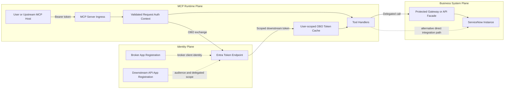
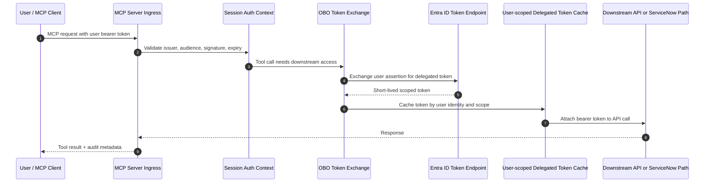
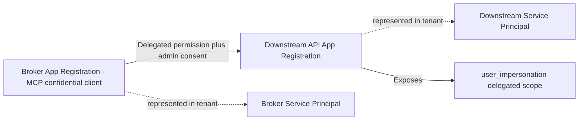
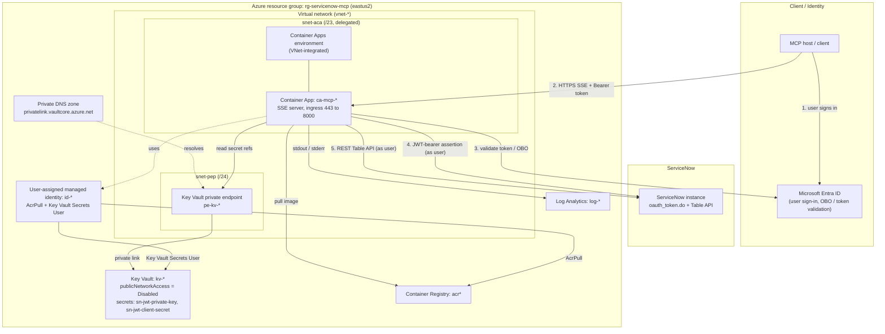
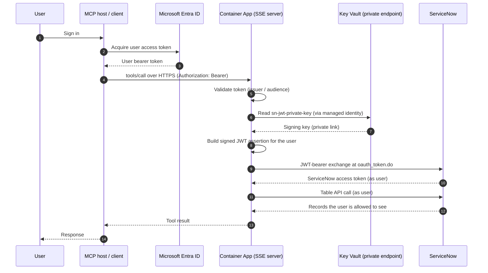

# ServiceNow MCP Server

[](https://opensource.org/licenses/MIT)

A Model Context Protocol (MCP) server that interfaces with ServiceNow, allowing AI agents to access and manipulate ServiceNow data through a secure API using explicit MCP tools and resources.

## Production MCP + OBO Path (Read This First)

If your goal is delegated user access through MCP, this is the runtime path:

1. Start the MCP server with `_start_mcp_server.bat` (or `python -m mcp_server_servicenow.cli`).
2. Connect your MCP host/client to that running server process.
3. MCP host sends user bearer token with each request.
4. Server validates incoming token and performs delegated downstream exchange based on configured OBO/JWT mode.
5. Server calls ServiceNow APIs as the delegated user.

Important distinction:

- `_start_mcp_server.bat`: production server entrypoint for MCP hosts.
- `_start_obo.bat`: interactive local test helper only (useful for manual validation, not the production MCP host path).

## Features

### Resources

- `servicenow://incidents/{number}`: Get a specific incident by number
- `servicenow://users`: List users
- `servicenow://knowledge`: List knowledge articles
- `servicenow://tables`: List available tables
- `servicenow://tables/{table}`: Get records from a specific table
- `servicenow://schema/{table}`: Get the schema for a table

> **Delegated identity flows through tools, not resources.** In the OBO / JWT-bearer
> mode the user's bearer token rides on MCP `tools/call` requests, but not on
> `resources/read` requests. Any operation that must run *as the signed-in user*
> is therefore exposed as a **tool** (see below). The resources above are usable in
> non-delegated / static-assertion setups.

### Tools

#### Basic Tools
- `list_incidents`: List the most recently updated incidents visible to the delegated user
- `create_incident`: Create a new incident
- `update_incident`: Update an existing incident
- `search_records`: Search for records using text query
- `get_record`: Get a specific record by sys_id
- `perform_query`: Perform a query against ServiceNow
- `add_comment`: Add a comment to an incident (customer visible)
- `add_work_notes`: Add work notes to an incident (internal)

#### Script Management Tool
- `update_script`: Update ServiceNow script files (script includes, business rules, etc.)

## Installation

This repository is currently supported as a source checkout only.

### From Source

```bash
git clone https://github.com/drewelewis/ai-servicenow-mcp-obo.git
cd ai-servicenow-mcp-obo
pip install -e .
```

Notes:

1. Do not use the original upstream repository URL for this fork's OBO-specific changes.
2. Do not rely on a PyPI package for this repo's current feature set.
3. On Windows, you can also use the provided helper scripts for local setup: `_env_create.bat`, `_env_activate.bat`, and `_install.bat`.

## Getting Started

This is a reusable integration. You bring your own ServiceNow instance and your own
Entra tenant, and the scripts in this repo configure them for you. The steps below are
written in plain English so you can follow them from a clean machine.

> **The short version:** once you have a ServiceNow instance and its admin login,
> `scripts/service_now_setup.py` does the ServiceNow-side setup for you — it activates
> the required plugin, generates the signing keys, and creates the OAuth/JWT record.
> You do not have to click through the ServiceNow UI to wire any of that up.

### What you need before you start

1. A computer with Python 3.10 or newer.
2. A ServiceNow instance (see Step 1) and its admin username and password (see Step 2).
3. (Only if you want delegated Entra sign-in) The Azure CLI (`az`) installed and signed in.

### Step 1: Get a ServiceNow instance (PDI)

Sign up for a free ServiceNow Personal Developer Instance (PDI) at
<https://developer.servicenow.com/>. Request an instance and wait for it to come online.
You will end up with a URL that looks like `https://dev123456.service-now.com/`.

### Step 2: Get the admin username and password

When ServiceNow provisions your PDI it shows you the admin username (`admin`) and a
generated password. Copy both — you will paste them into the `.env` file in Step 3.
(If you lose the password, you can reset it from the ServiceNow Developer portal.)

### Step 3: Update the `.env` with your PDI details

If you have not already, clone this repo and install it:

```bash
git clone https://github.com/drewelewis/ai-servicenow-mcp-obo.git
cd ai-servicenow-mcp-obo
python -m venv .venv
pip install -e .
```

On Windows you can use the helper scripts instead:

```bat
_env_create.bat
_env_activate.bat
_install.bat
```

Then copy `.env.example` to `.env` and fill in the three values from Steps 1 and 2:

```bash
SERVICENOW_INSTANCE_URL=https://dev123456.service-now.com/
SERVICENOW_USERNAME=admin
SERVICENOW_PASSWORD=your-admin-password
```

The `.env` file is git-ignored, so your credentials are never committed.

> **If you reset your instance or admin password**, update these three values in `.env` to
> match the new instance. Resetting a Personal Developer Instance can change the
> `devNNNNNN` number in `SERVICENOW_INSTANCE_URL` and always issues a new
> `SERVICENOW_PASSWORD` (the username is normally still `admin`). Type the new password
> directly into `.env` — never share it in chat.

After saving, confirm admin basic auth works before running the full setup:

```bash
python scripts/service_now_setup.py --check-auth
```

A `401 Unauthorized` here means the credentials in `.env` do not match the instance.

### Step 4: Generate the signing keys and JWKS document

**Why a JWKS is needed:** This integration calls ServiceNow **on behalf of the signed-in
user** (the delegated / on-behalf-of flow) without storing that user's ServiceNow password.
When the server needs a ServiceNow access token, it mints a short-lived JWT **assertion** —
signed with a private RSA key that never leaves your machine — whose `sub` claim names the
user to act as. It sends that assertion to ServiceNow's OAuth token endpoint using the JWT
bearer grant, and ServiceNow returns an access token, which the server **caches per user and
reuses** until it nears expiry (a new assertion is only minted when no valid token is
cached). ServiceNow verifies the assertion's signature using the matching **public** key,
published as a JWKS (JSON Web Key Set) — the standard JSON document that holds the public key
and its key ID (`kid`). Because ServiceNow fetches the JWKS from a URL you control, it can
trust your server's signed claim about which user is acting **without ever holding your
private key**, and you can rotate keys by republishing an updated JWKS.

The setup script does the ServiceNow-side work for you. Because ServiceNow has to fetch
your **public** key from a URL it can reach, run it first in generate-only mode so you have
the JWKS document to publish before any ServiceNow records are created:

```bash
python scripts/service_now_setup.py --skip-records
```

This activates the required plugin, generates the RSA signing key and certificate on your
machine, and writes the public JWKS document to `.servicenow-jwt/jwks.json`. The private
key never leaves your machine and is git-ignored.

### Step 5: Publish the JWKS document at a public URL

Publish `.servicenow-jwt/jwks.json` somewhere ServiceNow can reach — for example, commit it
to your fork and use its raw GitHub URL
(`https://raw.githubusercontent.com/<owner>/<repo>/<branch>/.servicenow-jwt/jwks.json`, using
your default branch, e.g. `master` or `main`). Only the public key is published; the private
key stays on your machine.

Record that URL in your `.env` as `SERVICENOW_SN_JWT_JWKS_URL` so the next step can read it
automatically:

```dotenv
SERVICENOW_SN_JWT_JWKS_URL=https://raw.githubusercontent.com/<owner>/<repo>/<branch>/.servicenow-jwt/jwks.json
```

### Step 6: Provision the ServiceNow `oauth_jwt` record

Run the setup script again to create the ServiceNow OAuth client record. It reads the JWKS
URL from `SERVICENOW_SN_JWT_JWKS_URL` in your `.env` (set in Step 5), so no flag is needed:

```bash
python scripts/service_now_setup.py
```

If you prefer to pass it explicitly (or override `.env`), use the `--jwks-url` flag:

```bash
python scripts/service_now_setup.py --jwks-url "<public-jwks-url>"
```

What the full run does for you, in order:

1. Installs (activates) the required ServiceNow plugin via the CI/CD API.
2. Generates the RSA signing key and certificate on your machine.
3. Generates the public JWKS document from that key.
4. Builds the ServiceNow OAuth/JWT provisioning payloads.
5. Creates (or updates) the ServiceNow `oauth_jwt` client record.
6. Writes the resulting `SERVICENOW_SN_JWT_*` values to `servicenow-jwt-bootstrap.env`.
7. Updates your `.env` in place with the provisioned `SERVICENOW_SN_JWT_*` values (for
   example the new `SERVICENOW_SN_JWT_CLIENT_ID`), so you do not have to copy them by hand.
   The one value it cannot fill is `SERVICENOW_SN_JWT_CLIENT_SECRET` (visible only in the
   ServiceNow UI); an existing secret is never overwritten, and a placeholder is added if the
   key is missing.

Every step is idempotent, so it is safe to re-run. If you already host the JWKS somewhere
public, you can skip Steps 4-5 and run this command directly.

> **No manual SSO or account-recovery step is required.** The plugin the script activates
> enables Multiple Provider SSO, and enabling multi-SSO on its own does **not** block basic
> auth — the setup script and the MCP server keep calling the ServiceNow REST API as
> `admin` over basic auth. **Do not enable Account Recovery.** It is a separate feature that
> is only ever turned on manually in the ServiceNow UI; when enabled it blocks local (basic
> auth) login for every account except the designated Account Recovery (ACR) user, and even
> designating `admin` as the ACR user only restores the interactive UI side-door login, not
> REST basic auth. Leaving Account Recovery off (the default) is all that is needed. If you
> ever get locked out of the login page, force the local login form with
> `https://<your-instance>.service-now.com/login.do?sysparm_prevent_sso=true` (or
> `/side_door.do`) and sign in as `admin`.

### Step 7: Finish the two things only a human can do

The script fills in every `SERVICENOW_SN_JWT_*` value in your `.env` except the client
secret, and it cannot create a matching user for you. ServiceNow does not expose either item
over the API, so complete the two tasks below in the ServiceNow web UI. Each is written for
someone who has never used ServiceNow before.

**7a. Copy the client secret into `.env`**

1. Sign in to your instance in a browser: `https://<your-instance>.service-now.com` (use the
   `admin` credentials from your `.env`).
2. In the **Filter navigator** (the search box at the top of the left menu), type
   `Application Registry` and click the **Application Registry** result under
   *System OAuth*.
3. In the list, find the row whose **Client ID** matches `SERVICENOW_SN_JWT_CLIENT_ID` from
   your `.env` (the setup run also printed it). It is named
   *MCP Entra to ServiceNow OBO*. Click that row to open it.
4. Find the **Client Secret** field. It is masked. Click the lock icon (🔒) at the right of
   the field to unlock it, then select and copy the revealed value.
5. Open your `.env`, find the `SERVICENOW_SN_JWT_CLIENT_SECRET=` line, and replace the
   `__SET_FROM_SERVICENOW_UI__` placeholder with the copied secret. Save the file. Type the
   value directly — do not paste it into chat or commit it (`.env` is git-ignored).

   *Note:* some JWT-bearer configurations do not require a client secret. If the login check in
   Step 9 succeeds while the placeholder is still present, you can leave that line as-is.

**7b. Make sure the Entra user you sign in as also exists in ServiceNow**

This integration is delegated: when you run the login helper (Step 9) or use the MCP server,
you sign in as a **real Microsoft Entra user**, and the flow acts in ServiceNow *as that same
person*. ServiceNow finds the matching account by comparing the Entra token's
`SERVICENOW_SN_JWT_USER_CLAIM_SOURCE` claim (default `preferred_username`, i.e. the user's
email / UPN) against the ServiceNow user field configured on the OAuth record (default
`email`). The two directories must therefore contain the **same identity**. If no ServiceNow
user has that email, ServiceNow rejects the exchange with `invalid_grant` / `User not found`.

1. Find the exact Entra identity you will sign in as. The reliable way is to run the login
   helper once and read the claim it prints:

   ```bash
   python scripts/login.py
   ```

   In the `User token claims` block, copy the `preferred_username` value
   (for example `jane.doe@contoso.onmicrosoft.com`). That is the identity ServiceNow must
   recognize.

2. In ServiceNow, open the **Filter navigator**, type `Users`, and click **Users** under
   *User Administration*.
3. Search (by **Email**) for that `preferred_username` value.
   - **If a matching user already exists**, open it, confirm the **Email** equals that value,
     and make sure the user is **Active** with the role(s) needed for the operations you will
     test (for incident queries, the `itil` role).
   - **If no user exists**, click **New**, set the **User ID** (e.g. `mcp.obo.test`) and
     **Email** to that value, click **Submit**, mark the user **Active**, and grant the
     required role(s).

   > **Do not map this identity to the `admin` user** (or any account holding the `admin` /
   > `security_admin` role). ServiceNow blocks delegated JWT-bearer token grants for
   > privileged accounts and returns
   > `invalid_grant` / `Grant access token to admin is not allowed`. Always use a dedicated,
   > non-privileged user with only the role(s) it needs. If you previously set the target
   > email on the `admin` user, clear it first (emails must be unique) and move it to the
   > dedicated user.
4. Re-run the login helper in Step 9; the `User not found` error should be gone.

> Tip: sign in at the device-code prompt as the *same* Entra user whose email you mapped
> here. Signing in as a different Entra user will again fail with `User not found` unless that
> user is also mapped in ServiceNow.

### Step 8 (optional): Set up Entra delegated sign-in

If you want on-behalf-of (OBO) user sign-in through Microsoft Entra, you do **not** create the
app registrations by hand — [scripts/bootstrap-entra-obo.ps1](scripts/bootstrap-entra-obo.ps1)
provisions them for you with the Azure CLI. It is idempotent (existing apps are reused by
display name, so re-running is safe) and creates the three registrations the OBO flow needs:

| App (display name) | Role | `.env` values it fills |
| --- | --- | --- |
| `servicenow-mcp-obo-interactive-client` | Public client the user signs into (device-code / interactive). Configured as a fallback public client with `http://localhost` redirect. | `SERVICENOW_OBO_PUBLIC_CLIENT_ID` |
| `servicenow-mcp-obo-broker` | Confidential middle-tier API that receives the user token and performs the OBO exchange. Exposes `user_impersonation`; holds the client secret. | `SERVICENOW_OBO_CLIENT_ID`, `SERVICENOW_OBO_CLIENT_SECRET`, `SERVICENOW_OBO_USER_SCOPE`, `SERVICENOW_SN_JWT_UPSTREAM_CLIENT_ID` |
| `servicenow-mcp-obo-downstream-api` | Downstream API the broker calls on the user's behalf. Exposes `user_impersonation`. | `SERVICENOW_OBO_SCOPE` |

Why three apps? OBO is a multi-hop delegation, and Entra requires each hop to be a distinct
app with its own audience: the public client can't hold a secret, the broker must be a
different audience than the client that requested the token (that is what makes the exchange
an *on-behalf-of* exchange), and the downstream API is the resource the broker calls as the
user. See [obo-flow-options.md](obo-flow-options.md) for the full comparison and diagrams.

**Prerequisites**

- Azure CLI installed and signed in (`az login`) to the tenant that will own the apps.
- Your account can **create app registrations** and (ideally) **grant admin consent**. If it
  cannot consent, the script continues and prints the `az ad app permission admin-consent`
  command for a tenant admin to run.

**Run it**

```powershell
az login
# Uses the signed-in tenant by default; pass -TenantId to target a specific tenant.
.\scripts\bootstrap-entra-obo.ps1 -OutputEnvFile ".env.obo.generated"
.\scripts\apply-obo-env.ps1 -SourceEnvFile ".env.obo.generated" -TargetEnvFile ".env"
```

What `bootstrap-entra-obo.ps1` does, in order:

1. Ensures the three app registrations exist (creating any that are missing) and a service
   principal for each.
2. Marks the interactive client as a public client (`http://localhost` redirect).
3. Exposes the `user_impersonation` scope (token version 2) on the broker and downstream apps
   under their `api://<appId>` identifier URIs.
4. Configures optional claims (`preferred_username`, `email`, `upn`) on the **broker** app for
   both its access token and id token, so the token the MCP server validates carries the
   delegated user's identity (`email`/`upn` appear only when also set on the user).
5. Grants the delegated permissions for each hop (interactive client → broker, broker →
   downstream) and attempts admin consent.
6. Creates/rotates the broker client secret (`--append`, default 1-year lifetime).
7. Writes the resulting `SERVICENOW_OBO_*` / `SERVICENOW_SN_JWT_UPSTREAM_CLIENT_ID` values to
   the output env file, which `apply-obo-env.ps1` then merges into your `.env`.

**Customization** — override any of these parameters when you run the script:
`-TenantId`, `-BrokerAppName`, `-InteractiveClientAppName`, `-DownstreamApiAppName`,
`-BrokerScopeName`, `-DownstreamScopeName`, `-SecretYears`, `-OutputEnvFile`.

> Security note: the broker client secret is written only to the generated env file and then
> your git-ignored `.env`. Do not commit either. Re-running the script rotates the secret
> (append mode keeps older secrets valid until they expire).

**Token claims (how identity flows to ServiceNow)**

The whole delegated flow hinges on one thing: the claim in the Entra token that identifies the
signed-in user, which the MCP server uses as the subject of the assertion it sends to
ServiceNow. The tokens issued for this flow carry these claims:

| Claim | Source | Always present? | Role in this integration |
| --- | --- | --- | --- |
| `preferred_username` | Default v2 claim (also requested explicitly in Step 8.4) | Yes | **The subject.** Default value of `SERVICENOW_SN_JWT_USER_CLAIM_SOURCE`; matched against the ServiceNow user field (default `email`). |
| `email` | Optional claim (added in Step 8.4) | Only if the user has an email set in Entra | Alternative subject if you set `SERVICENOW_SN_JWT_USER_CLAIM_SOURCE=email`. |
| `upn` | Optional claim (added in Step 8.4) | Only for managed (non-guest) users with a UPN | Alternative subject for on-prem-synced identities. |
| `oid` | Default | Yes | Immutable Entra object ID; stable but not human-readable. |
| `sub` | Default | Yes | Pairwise subject (per app); not portable across apps. |
| `name`, `tid`, `aud` | Default | Yes | Display name, tenant, and audience (the broker app). |

Key points:

- The bootstrap script requests `preferred_username`, `email`, and `upn` as optional claims on
  the broker app (Step 8.4), but Entra only emits `email`/`upn` when the user actually has those
  attributes populated in the directory. Many cloud-only accounts have no `email` value, so that
  claim can still come through empty — `preferred_username` is the reliable subject.
- Whatever claim you choose via `SERVICENOW_SN_JWT_USER_CLAIM_SOURCE` must match the ServiceNow
  user field configured on the OAuth record (`user_field`, default `email`). The two are
  compared as exact strings. See Step 7b for creating the matching ServiceNow user.
- Run `python scripts/login.py` (Step 9) to print the exact claim
  values your tenant emits for a given user before you configure the ServiceNow mapping.

### Step 9: Check that it works

```bash
python scripts/login.py
```

At the device-code prompt, sign in as the **Entra user you mapped in Step 7b** (the one whose
`preferred_username` matches a ServiceNow user's email). This confirms the user token is
acquired, exchanged at ServiceNow *as that delegated user*, and that an incident query
succeeds through the MCP auth path.

### Step 10: Start the MCP server

```bash
python -m mcp_server_servicenow.cli --transport stdio
```

Windows shortcut:

```bat
_start_mcp_server.bat
```

### Step 11: Try it interactively with MCP Inspector (delegated tool calls)

Once the login check passes you can exercise the real delegated path by hand using the
[MCP Inspector](https://github.com/modelcontextprotocol/inspector). Because delegated
identity travels on the request's `Authorization` header, use the **SSE** transport (stdio
is a pipe and carries no HTTP headers, so it can list tools but cannot make delegated
calls).

1. **Start the server in SSE mode** (leave it running):

   ```bash
   python -m mcp_server_servicenow.cli --transport sse
   ```

   It listens on `http://127.0.0.1:8000` and serves the stream at `/sse`.

2. **Acquire a user token** for the broker audience via device-code sign-in. The command
   below copies the token to your clipboard **and** prints it to the terminal so you can
   copy it again later (never paste tokens into chat). On Windows PowerShell:

   ```powershell
   python -c "import msal,os,sys; from dotenv import load_dotenv; load_dotenv(); t=os.environ['SERVICENOW_SN_JWT_TENANT_ID']; pc=os.environ.get('SERVICENOW_OBO_PUBLIC_CLIENT_ID') or os.environ['SERVICENOW_SN_JWT_UPSTREAM_CLIENT_ID']; up=os.environ['SERVICENOW_SN_JWT_UPSTREAM_CLIENT_ID']; app=msal.PublicClientApplication(pc, authority='https://login.microsoftonline.com/'+t); f=app.initiate_device_flow(scopes=[up+'/.default']); print(f['message'], file=sys.stderr); r=app.acquire_token_by_device_flow(f); sys.stdout.write(r.get('access_token') or ('ERROR: '+str(r.get('error_description'))))" | Tee-Object -Variable userToken | Set-Clipboard; $userToken
   ```

   `Tee-Object` passes the token to `Set-Clipboard` and also stores it in `$userToken`,
   which the trailing `$userToken` prints to the terminal for later reuse. Open the printed
   URL, enter the code, and sign in as the **Entra user you mapped in Step 7b**. The token
   is short-lived (~1 hour) — re-run this to refresh it.

3. **Launch the Inspector in writable mode** (no preset server, so you can add an SSE
   connection with a custom header):

   ```bash
   npx -y @modelcontextprotocol/inspector
   ```

   Open the printed `http://localhost:6274/...` URL.

4. **Add the SSE connection** in the Inspector:
   - **Transport Type**: `SSE`
   - **URL**: `http://127.0.0.1:8000/sse`
   - Under **Custom Headers**, add `Authorization` = `Bearer <paste your clipboard token>`.
   - Leave the **OAuth** section empty (if OAuth is configured, the Inspector owns the
     `Authorization` header and ignores your custom value).

5. **Connect**, open the **Tools** tab, **List Tools**, then run **`list_incidents`** (no
   inputs). It returns the incidents visible to your delegated user. Watch the server
   terminal for `POST /oauth_token.do` and `GET /api/now/table/incident` returning `200 OK`.

> If a tool call fails with `Missing incoming user token`, the `Authorization` header did
> not reach the server — confirm you are on the **SSE** transport (not stdio) and the header
> value starts with `Bearer `. An `invalid_grant` / expired-token error means the clipboard
> token aged out; refresh it with the command in step 2.

### If something goes wrong

1. `oauth_token.do` returns 401/400:
  - Check the ServiceNow system log (`com.glide.ui.ServletErrorListener`) for the real cause.
2. `invalid_grant` with `User not found`:
  - Make sure a ServiceNow user exists whose email matches the claim configured in Step 7b.
3. `invalid_grant` with `Grant access token to admin is not allowed`:
  - You mapped the identity to the `admin` user (or an account with the `admin` /
    `security_admin` role). ServiceNow blocks delegated grants for privileged accounts.
    Clear that email from the privileged user and map it to a dedicated non-admin user
    (see Step 7b).
4. Setup looks complete but the flow still fails:
  - Re-run `scripts/service_now_setup.py` (it is safe to re-run) and re-check `.env`.
  - Verify `.env` does not contain a stale client ID or an old client secret.

## Usage

### Command Line

Run the server using the Python module.

Choose one authentication mode per deployment.

#### Usage: Basic Auth

Compatibility path only. Use this only if your ServiceNow tenant still allows direct username/password authentication.

Command-line example:

```bash
python -m mcp_server_servicenow.cli --url "https://your-instance.service-now.com/" --username "your-username" --password "your-password"
```

Environment-variable example:

```bash
export SERVICENOW_INSTANCE_URL="https://your-instance.service-now.com/"
export SERVICENOW_USERNAME="your-username"
export SERVICENOW_PASSWORD="your-password"
python -m mcp_server_servicenow.cli
```

Windows PowerShell example:

```powershell
$env:SERVICENOW_INSTANCE_URL="https://your-instance.service-now.com/"
$env:SERVICENOW_USERNAME="your-username"
$env:SERVICENOW_PASSWORD="your-password"
python -m mcp_server_servicenow.cli
```

#### Usage: Bearer Token

Use this mode when you already have a valid ServiceNow bearer token and want the server to reuse it directly.

Command-line example:

```bash
python -m mcp_server_servicenow.cli --url "https://your-instance.service-now.com/" --token "<servicenow-access-token>"
```

Environment-variable example:

```bash
export SERVICENOW_INSTANCE_URL="https://your-instance.service-now.com/"
export SERVICENOW_TOKEN="<servicenow-access-token>"
python -m mcp_server_servicenow.cli
```

#### Usage: ServiceNow OAuth

Use this mode when ServiceNow itself is the resource server and your tenant does not permit basic auth or you want a stronger direct-auth pattern.

Command-line example:

```bash
python -m mcp_server_servicenow.cli \
  --url "https://your-instance.service-now.com/" \
  --client-id "<servicenow-oauth-client-id>" \
  --client-secret "<servicenow-oauth-client-secret>" \
  --username "<servicenow-username>" \
  --password "<servicenow-password>"
```

Environment-variable example:

```bash
export SERVICENOW_INSTANCE_URL="https://your-instance.service-now.com/"
export SERVICENOW_CLIENT_ID="<servicenow-oauth-client-id>"
export SERVICENOW_CLIENT_SECRET="<servicenow-oauth-client-secret>"
export SERVICENOW_USERNAME="<servicenow-username>"
export SERVICENOW_PASSWORD="<servicenow-password>"
python -m mcp_server_servicenow.cli
```

#### Usage: Entra OBO

Use OBO when your upstream caller provides a user bearer token and you want delegated downstream access.

Command-line example:

```bash
python -m mcp_server_servicenow.cli \
  --url "https://your-instance.service-now.com/" \
  --obo-tenant-id "<tenant-guid>" \
  --obo-client-id "<broker-app-client-id>" \
  --obo-client-secret "<broker-app-client-secret>" \
  --obo-scope "api://<downstream-app-id>/.default"
```

Environment-variable example:

```bash
export SERVICENOW_INSTANCE_URL="https://your-instance.service-now.com/"
export SERVICENOW_OBO_TENANT_ID="<tenant-guid>"
export SERVICENOW_OBO_CLIENT_ID="<broker-app-client-id>"
export SERVICENOW_OBO_CLIENT_SECRET="<broker-app-client-secret>"
export SERVICENOW_OBO_SCOPE="api://<downstream-app-id>/.default"
python -m mcp_server_servicenow.cli
```

Windows PowerShell example:

```powershell
$env:SERVICENOW_INSTANCE_URL="https://your-instance.service-now.com/"
$env:SERVICENOW_OBO_TENANT_ID="<tenant-guid>"
$env:SERVICENOW_OBO_CLIENT_ID="<broker-app-client-id>"
$env:SERVICENOW_OBO_CLIENT_SECRET="<broker-app-client-secret>"
$env:SERVICENOW_OBO_SCOPE="api://<downstream-app-id>/.default"
python -m mcp_server_servicenow.cli
```

#### Auth Selection Rules

1. OBO and basic auth are both supported, but they are separate auth modes.
2. If complete OBO settings are present, the CLI selects OBO.
3. If OBO is not configured, the CLI can fall back to token auth, OAuth, or basic username/password.
4. Do not assume `--username` and `--password` are combined with OBO; they are used for the non-OBO auth paths.

### Interactive CLI Helper

If you want a quick local script that runs a menu of common MCP operations using your configured `.env` auth settings, use:

```bash
python scripts/interactive_mcp_client.py
```

To print the supported command list without starting interactive mode:

```bash
python scripts/interactive_mcp_client.py --list-commands
```

This helper supports the same non-basic auth configuration patterns as the CLI (OBO, bearer token, or ServiceNow OAuth).

For local testing, if the incoming user assertion is unset/placeholder the helper auto-acquires
an Entra user token. By default it uses the **device-code flow**: it prints a verification URL
and a code (for `https://microsoft.com/devicelogin`) so you can complete sign-in in **any
browser you choose** — the helper does not launch a system browser. Sign in as the Entra user
you mapped in Step 7b (a non-admin ServiceNow user).

```text
To sign in, use a web browser to open the page https://microsoft.com/devicelogin
and enter the code XXXXXXXXX to authenticate.
```

Sign-in flags and settings:

- `--use-device-code` (default on; also `SERVICENOW_USE_DEVICE_CODE=true`) — print a URL + code and let you use any browser.
- `--no-device-code` — use MSAL interactive browser sign-in (system browser popup) instead of the device-code flow.
- optional `SERVICENOW_OBO_PUBLIC_CLIENT_ID` (defaults to `SERVICENOW_OBO_CLIENT_ID`)
- optional `SERVICENOW_OBO_USER_SCOPE` (defaults to `<SERVICENOW_OBO_CLIENT_ID>/.default` GUID-based scope)
- optional `SERVICENOW_OBO_ALLOW_DEVICE_CODE_FALLBACK=true` to fall back to device-code flow when `--no-device-code` browser sign-in is unavailable

This simulates the incoming user bearer token a Teams-like client would normally pass to the MCP server.

### Repeatable ServiceNow JWT Login Check

Use the dedicated login helper to sign in and validate the complete delegated JWT bearer path end-to-end with one command.

Script path:

- `scripts/login.py`

Run:

```bash
python scripts/login.py
```

What it verifies:

1. Device-code sign-in and Entra user token acquisition (prints the token claims).
2. ServiceNow oauth_token.do JWT bearer exchange.
3. ServiceNow incident table query through MCP server auth path.

### OBO Flow Options and Architecture Breakdown

For a complete breakdown of both delegated auth patterns, tradeoffs, and architecture diagrams, see:

- [obo-flow-options.md](obo-flow-options.md)

### MCP Explorer (Inspector) Quick Start

If you are using this repository scripts on Windows:

1. Create and activate the virtual environment.
2. Copy `.env.example` to `.env` and fill in your ServiceNow credentials.
3. Install dependencies.
4. Start MCP Explorer.

```bat
_env_create.bat
_env_activate.bat
copy .env.example .env
_install.bat
_start_mcp_explorer.bat
```

Stop MCP Explorer when done:

```bat
_stop_mcp_explorer.bat
```

Why this matters: `_start_mcp_explorer.bat` launches `python -m mcp_server_servicenow.cli`, which loads values from `.env` automatically.

### Configuration in Cline

To use this MCP server with Cline, add args for the auth mode you actually intend to run. Example below shows the basic-auth variant only.

```json
{
  "mcpServers": {
    "servicenow": {
      "command": "/path/to/your/python/executable",
      "args": [
        "-m",
        "mcp_server_servicenow.cli",
        "--url", "https://your-instance.service-now.com/",
        "--username", "your-username",
        "--password", "your-password"
      ],
      "disabled": false,
      "autoApprove": []
    }
  }
}
```

**Note:** Make sure to use the full path to the Python executable that has the `mcp-server-servicenow` package installed.

## Troubleshooting Startup

- `Error: ServiceNow instance URL is required`
  - Set `SERVICENOW_INSTANCE_URL` in your environment, or create `.env` from `.env.example`.
- `Error: Authentication credentials required`
  - Provide one supported auth method in `.env` (basic auth, token, or OAuth values).
- `npx was not found`
  - Install Node.js so `npx` is available in `PATH`.

- `AADSTS399274: application is configured for SAML SSO and could not be used with non-SAML protocol`
  - The OBO downstream resource in `SERVICENOW_OBO_SCOPE` points to a SAML-only enterprise app.
  - Use an OAuth/OIDC-capable resource app scope (for example `api://<app-id>/.default`) for OBO token exchange.
  - If you need direct ServiceNow API acceptance, configure ServiceNow to trust Entra-issued OAuth/OIDC bearer tokens for the chosen audience; SAML-only app registrations cannot be used for OBO token issuance.

## Tool Usage Examples

Use explicit tool inputs for all operations. For searching and updates, call `search_records`, `perform_query`, `update_incident`, `add_comment`, and `add_work_notes` directly with structured arguments.

### Managing Scripts

You can update ServiceNow scripts from local files:

```
Update the ServiceNow script include "HelloWorld" with the contents of hello_world.js
Upload utils.js to ServiceNow as a script include named "UtilityFunctions"
Update @form_validation.js, it's a client script called "FormValidation"
```

## Authentication Methods

The server supports multiple authentication methods, but they are not equally appropriate for every ServiceNow environment.

1. **Basic Authentication**
  - Uses `--username` and `--password`.
  - Best treated as compatibility-only because many ServiceNow tenants disable or discourage it.
2. **Bearer Token Authentication**
  - Uses `--token`.
  - Useful when you already have a valid ServiceNow access token outside this process.
3. **ServiceNow OAuth Authentication**
  - Uses `--client-id`, `--client-secret`, `--username`, and `--password`.
  - This is the direct OAuth path where ServiceNow is the resource server.
4. **Entra OBO Authentication**
  - Uses `--obo-*` settings.
  - This is the delegated Entra identity path and is architecturally different from native ServiceNow OAuth.

### Recommended Auth Mode By Scenario

1. **You need the simplest local compatibility setup and your tenant still permits it**
  - Use Basic Authentication.
2. **You already have a valid ServiceNow bearer token**
  - Use Bearer Token Authentication.
3. **You want direct modern auth to ServiceNow**
  - Use ServiceNow OAuth Authentication.
4. **You need delegated per-user identity from Entra or an upstream enterprise caller**
  - Use Entra OBO Authentication.

### Entra OBO Setup

Use OBO when you want per-user delegated access instead of storing static ServiceNow credentials.

#### Architecture Overview


```mermaid
flowchart LR
  subgraph ID[Identity Plane]
    B[Broker App Registration]
    E[Entra Token Endpoint]
    D[Downstream API App Registration]
  end

  subgraph RT[MCP Runtime Plane]
    U[User or Upstream MCP Host]
    I[MCP Server Ingress]
    C[Validated Request Auth Context]
    T[Tool Handlers]
    K[User-scoped OBO Token Cache]
  end

  subgraph BS[Business System Plane]
    G[Protected Gateway or API Facade]
    S[ServiceNow Instance]
  end

  U -->|Bearer token| I
  I --> C
  C --> T
  C -->|OBO exchange| E
  B -. broker client identity .-> E
  D -. audience and delegated scope .-> E
  E -->|Scoped downstream token| K
  K --> T
  T -->|Delegated call| G
  G --> S
  T -. alternative direct integration path .-> S
```

Read this diagram in three layers:

1. Identity plane defines who can mint and accept delegated tokens.
2. MCP runtime plane validates the incoming user, performs OBO, and executes tools.
3. Business system plane is where ServiceNow is ultimately reached, either directly or through a protected facade.

#### Design Check

This repository currently models an Entra-based delegated access pattern with these important boundaries:

1. The MCP server acts as the broker confidential client.
2. The incoming user token is captured from the active MCP request context and used for OBO exchange.
3. The exchanged token is meant for the configured downstream audience, not automatically for every HTTP endpoint.
4. A direct ServiceNow call only works with this pattern if the downstream target can validate the Entra-issued bearer token or is fronted by a gateway that can.

Practical implication:

- If you call ServiceNow through an Entra-protected API or gateway, the broker/downstream app-registration model fits well.
- If you call ServiceNow directly and it is not validating your Entra token as a resource audience, use one of the alternatives below instead of assuming raw OBO is enough by itself.

#### Main Components And Why They Exist

1. MCP client or upstream host:
  - Originates the request on behalf of a signed-in user.
  - Supplies the user assertion token that anchors delegated identity.
2. MCP server ingress:
  - Receives the MCP request and extracts transport auth metadata.
  - Prevents tool execution from running without an authenticated caller context.
3. Request auth context:
  - Holds the current request's user assertion in request-scoped state.
  - Prevents one user's delegated token flow from being sourced from another request.
4. Broker app registration:
  - Represents this MCP server as a confidential Entra client.
  - Is required so the server can perform the OBO token exchange.
5. Entra token endpoint:
  - Exchanges the upstream user assertion for a scoped downstream access token.
  - Enforces tenant, consent, and delegated-permission policy.
6. Downstream API app registration:
  - Represents the resource audience the broker is requesting access to.
  - Exposes the delegated scope that the broker asks for during OBO.
7. Service principals:
  - Materialize both app registrations inside the tenant.
  - Are required for consent, policy enforcement, and enterprise administration.
8. Downstream connector target:
  - Is the actual HTTP target that receives the delegated bearer token.
  - In this design, that target should be an Entra-protected API, gateway, or another resource that trusts the issued token.
9. ServiceNow instance:
  - Remains the system of record for incidents, tables, scripts, and user-facing operations.
  - May be reached directly, or indirectly through a gateway or facade depending on the auth pattern you choose.

#### Where Each Component Sits In The Design

- Identity plane:
  - Broker app registration, downstream app registration, service principals, Entra token endpoint.
- MCP runtime plane:
  - MCP client, MCP server ingress, request auth context, tool handlers.
- Business system plane:
  - Downstream connector target and the ServiceNow instance.

Production note:

- The current implementation validates incoming Entra bearer tokens for signature, issuer, audience, and expiry before OBO exchange.
- The current implementation also keeps delegated tokens in a user-scoped in-memory cache keyed by validated identity plus downstream scope and token endpoint.
- Broader production hardening remains tracked in [todo.md](todo.md), including policy refinement, retry behavior, and full conformance coverage.

#### MCP OBO Flow


```mermaid
sequenceDiagram
  autonumber
  participant U as User / MCP Client
  participant I as MCP Server Ingress
  participant C as Session Auth Context
  participant O as OBO Token Exchange
  participant E as Entra ID Token Endpoint
  participant K as User-scoped Delegated Token Cache
  participant S as Downstream API or ServiceNow Path

  U->>I: MCP request with user bearer token
  I->>C: Validate issuer, audience, signature, expiry
  C->>O: Tool call needs downstream access
  O->>E: Exchange user assertion for delegated token
  E-->>O: Short-lived scoped token
  O->>K: Cache token by user identity and scope
  K->>S: Attach bearer token to API call
  S-->>I: Response
  I-->>U: Tool result + audit metadata
```

Flow summary:

1. The MCP request carries the user assertion.
2. The server validates identity and binds it to a session context.
3. The server performs OBO exchange for downstream scoped access.
4. The delegated token is cached per user and downstream scope until near expiry.
5. Result metadata is returned to the caller.

#### Fully Scriptable Entra Bootstrap

This repository now includes a script that creates everything needed in Entra for OBO and prints the exact `.env` values for this server.

Purpose of the Entra registrations:

1. Broker app registration:
  - Represents this MCP server as a confidential client.
  - Accepts the incoming user assertion and performs OBO token exchange.
2. Downstream API app registration:
  - Represents the resource API audience for delegated access.
  - Exposes the delegated scope (for example, `user_impersonation`) that the broker requests.
3. Service principals:
  - Materialize both app registrations in your tenant so permissions and consent can be enforced.
4. Delegated permission + admin consent:
  - Grants the broker app permission to request downstream delegated tokens for signed-in users.
  - Ensures OBO calls are authorized by policy instead of static shared credentials.

Registration relationship (quick view):


```mermaid
flowchart LR
  B[Broker App Registration - MCP confidential client]
  D[Downstream API App Registration]
  SC[user_impersonation delegated scope]
  B -. "represented in tenant" .-> SB[Broker Service Principal]
  D -. "represented in tenant" .-> SD[Downstream Service Principal]
  B -->|Delegated permission plus admin consent| D
  D -->|Exposes| SC
```

#### When This Design Is The Right Fit

Use this brokered OBO design when all of the following are true:

1. Your upstream caller already authenticates users with Entra ID.
2. You need per-user delegated authorization, not a shared integration identity.
3. Your downstream API can validate the Entra token directly, or is fronted by a gateway that can.

Optional validation configuration:

- `SERVICENOW_OBO_EXPECTED_AUDIENCE`: comma-separated allowed audiences for incoming bearer tokens. Defaults to the broker app client ID.
- `SERVICENOW_OBO_EXPECTED_ISSUER`: comma-separated allowed issuers for incoming bearer tokens. Defaults to Entra tenant issuers for the configured tenant.

#### Potential Alternatives

1. Direct ServiceNow basic auth:
  - Simplest setup.
  - Uses a shared integration identity, so it does not preserve end-user authorization boundaries.
2. Direct ServiceNow OAuth with a shared service account:
  - Better secret hygiene than basic auth.
  - Still behaves like app-owned access unless you build separate per-user token handling.
3. ServiceNow-native per-user OAuth:
  - Best fit when ServiceNow itself is the true resource server and must authorize each user directly.
  - More operationally complex because you manage ServiceNow OAuth trust and user-consent flows instead of Entra OBO alone.
4. Entra-protected gateway or facade in front of ServiceNow:
  - Best fit for this repository's current broker/downstream app-registration shape.
  - Lets the gateway validate Entra tokens, enforce policy, and then call ServiceNow with its own trusted backend mechanism.
5. App-only or client-credentials integration:
  - Useful for unattended automation or batch operations.
  - Not appropriate when you must preserve the initiating user's security boundary.

Recommended decision rule:

- If the goal is true per-user delegation into a resource that trusts Entra tokens, keep the brokered OBO design.
- If the goal is direct ServiceNow access and ServiceNow is the real authorization authority, prefer ServiceNow-native OAuth or a gateway pattern.

Script path:

- `scripts/bootstrap-entra-obo.ps1`

What the script does:

1. Creates or reuses a broker app registration (the MCP server confidential client).
2. Creates or reuses an interactive public-client app registration (for local MFA popup sign-in).
3. Creates or reuses a downstream API app registration.
4. Creates service principals for all three apps.
5. Configures an exposed delegated scope on the broker API.
6. Configures an exposed delegated scope on the downstream API.
7. Adds delegated permission from broker app to downstream API.
8. Adds delegated permission from interactive client app to broker API.
9. Attempts tenant-wide admin consent.
10. Creates/rotates a broker app client secret.
11. Writes and prints a generated env block with all required `SERVICENOW_OBO_*` values.

Prerequisites:

1. Azure CLI installed (`az`).
2. Signed in to Azure CLI (`az login`).
3. Permission to create app registrations and grant admin consent (or have an admin run consent step).

Run in PowerShell from repo root:

```powershell
# Optional: allow script execution for this session
Set-ExecutionPolicy -Scope Process -ExecutionPolicy RemoteSigned

# Sign in if needed
az login

# Run with defaults
.\scripts\bootstrap-entra-obo.ps1

# Or run with explicit names/tenant
.\scripts\bootstrap-entra-obo.ps1 `
  -TenantId "<tenant-guid>" `
  -BrokerAppName "servicenow-mcp-obo-broker" `
  -InteractiveClientAppName "servicenow-mcp-obo-interactive-client" `
  -BrokerScopeName "user_impersonation" `
  -DownstreamApiAppName "servicenow-mcp-obo-downstream-api" `
  -DownstreamScopeName "user_impersonation" `
  -SecretYears 1 `
  -OutputEnvFile ".env.obo.generated"
```

Expected output artifacts:

1. Console output with the generated env values.
2. A file (default `.env.obo.generated`) containing:
   - `SERVICENOW_OBO_TENANT_ID`
   - `SERVICENOW_OBO_CLIENT_ID`
   - `SERVICENOW_OBO_CLIENT_SECRET`
   - `SERVICENOW_OBO_SCOPE`
  - `SERVICENOW_OBO_PUBLIC_CLIENT_ID`
  - `SERVICENOW_OBO_USER_SCOPE`
   - `SERVICENOW_OBO_TOKEN_ENDPOINT`
   - `SERVICENOW_OBO_USER_ASSERTION` placeholder

Then apply those values to your `.env` used by this MCP server.

#### Merge Generated OBO Values Into .env

Use the helper script to merge generated OBO settings into your existing `.env` while preserving unrelated keys.

Script path:

- `scripts/apply-obo-env.ps1`

Run:

```powershell
# Dry run (shows which keys will be applied)
.\scripts\apply-obo-env.ps1 -SourceEnvFile ".env.obo.generated" -TargetEnvFile ".env" -WhatIfOnly

# Apply changes and create backup of .env
.\scripts\apply-obo-env.ps1 -SourceEnvFile ".env.obo.generated" -TargetEnvFile ".env"
```

Behavior:

1. Reads OBO values from the generated file.
2. Updates these keys in `.env`:
  - `SERVICENOW_OBO_TENANT_ID`
  - `SERVICENOW_OBO_CLIENT_ID`
  - `SERVICENOW_OBO_CLIENT_SECRET`
  - `SERVICENOW_OBO_SCOPE`
  - `SERVICENOW_OBO_PUBLIC_CLIENT_ID`
  - `SERVICENOW_OBO_USER_SCOPE`
  - `SERVICENOW_OBO_TOKEN_ENDPOINT`
  - `SERVICENOW_OBO_USER_ASSERTION`
  - `SERVICENOW_SN_JWT_TENANT_ID`
  - `SERVICENOW_SN_JWT_UPSTREAM_CLIENT_ID`
  - `SERVICENOW_SN_JWT_CLIENT_ID`
  - `SERVICENOW_SN_JWT_CLIENT_SECRET`
  - `SERVICENOW_SN_JWT_PRIVATE_KEY_PATH`
  - `SERVICENOW_SN_JWT_TOKEN_ENDPOINT`
  - `SERVICENOW_SN_JWT_USER_CLAIM_SOURCE`
  - `SERVICENOW_SN_JWT_SCOPE`
  - `SERVICENOW_SN_JWT_KID`
  - `SERVICENOW_SN_JWT_EXPECTED_AUDIENCE`
  - `SERVICENOW_SN_JWT_EXPECTED_ISSUER`
  - `SERVICENOW_SN_JWT_ASSERTION_TTL`
  - `SERVICENOW_SN_JWT_CACHE_SAFETY_BUFFER`
  - `SERVICENOW_SN_JWT_USER_ASSERTION`
  - `SERVICENOW_SN_JWT_ALLOW_STATIC_ASSERTION`
3. Creates timestamped backup file by default: `.env.bak-YYYYMMDD-HHMMSS`.

### Validated ServiceNow JWT Bearer Notes (This Tenant)

The following behaviors were validated during live end-to-end testing:

1. ServiceNow JWT bearer exchange and incident API calls succeed after mapping incoming Entra identity to an existing ServiceNow user.
2. ServiceNow token endpoint diagnostics are often generic; use ServiceNow syslog (`com.glide.ui.ServletErrorListener`) for root-cause errors.
3. The working ServiceNow JWT client wiring in this tenant used the ServiceNow OAuth client record that the JWT provider resolves at token exchange time.
4. A `User not found` invalid_grant from oauth_token.do was resolved by creating a matching `sys_user` for the incoming `preferred_username` claim.

Important runtime note:

- `SERVICENOW_OBO_USER_ASSERTION` is an incoming user token and should be supplied at runtime by your upstream caller/session, not hardcoded as a long-lived secret.

Set these environment variables:

```bash
SERVICENOW_INSTANCE_URL="https://your-instance.service-now.com/"
SERVICENOW_OBO_TENANT_ID="<tenant-id-guid>"
SERVICENOW_OBO_CLIENT_ID="<app-client-id>"
SERVICENOW_OBO_CLIENT_SECRET="<app-client-secret>"
SERVICENOW_OBO_SCOPE="api://<downstream-app-id>/.default"
SERVICENOW_OBO_PUBLIC_CLIENT_ID="<interactive-public-client-app-id>"
SERVICENOW_OBO_USER_SCOPE="api://<broker-app-id>/user_impersonation"
# Optional override
# SERVICENOW_OBO_TOKEN_ENDPOINT="https://login.microsoftonline.com/<tenant-id>/oauth2/v2.0/token"
# Optional local-only fallback if request transport cannot provide assertion
# SERVICENOW_OBO_ALLOW_STATIC_ASSERTION="false"
# SERVICENOW_OBO_USER_ASSERTION="<incoming-user-access-token>"
```

Then run:

```bash
python -m mcp_server_servicenow.cli --transport stdio
```

Notes:

- OBO mode is selected automatically when all required `SERVICENOW_OBO_*` values are present.
- OBO takes precedence over static token/basic auth.
- OBO uses request-bound bearer assertions by default and fails closed when assertion is missing.
- `SERVICENOW_OBO_ALLOW_STATIC_ASSERTION=true` is intended for local testing only.
- The downstream API represented by `SERVICENOW_OBO_SCOPE` must trust your Entra app and accept delegated tokens.

## Deploying to Azure (Container Apps)

The server can run locally for development or be hosted on **Azure Container Apps** for
remote MCP hosts. The Azure deployment uses the **Azure Developer CLI (`azd`)** with
Bicep infrastructure under [infra/](infra/), and runs the server over the **SSE**
transport behind external HTTPS ingress. Delegated identity still flows per request:
the MCP host presents the user's Entra bearer token on each `tools/call`, and the server
performs the ServiceNow JWT-bearer exchange as that user.

### Logical design


```mermaid
flowchart TB
    subgraph Client["Client / Identity"]
        Host["MCP host / client"]
        Entra["Microsoft Entra ID<br/>(user sign-in, OBO / token validation)"]
    end

    subgraph SN["ServiceNow"]
        SNInstance["ServiceNow instance<br/>oauth_token.do + Table API"]
    end

    subgraph RG["Azure resource group: rg-servicenow-mcp (eastus2)"]
        direction TB
        subgraph VNet["Virtual network (vnet-*)"]
            direction TB
            subgraph ACASubnet["snet-aca (/23, delegated)"]
                ACAEnv["Container Apps environment<br/>(VNet-integrated)"]
                App["Container App: ca-mcp-*<br/>SSE server, ingress 443 to 8000"]
            end
            subgraph PESubnet["snet-pep (/24)"]
                KVPE["Key Vault private endpoint<br/>pe-kv-*"]
            end
        end
        KV["Key Vault: kv-*<br/>publicNetworkAccess = Disabled<br/>secrets: sn-jwt-private-key, sn-jwt-client-secret"]
        ACR["Container Registry: acr*"]
        UAMI["User-assigned managed identity: id-*<br/>AcrPull + Key Vault Secrets User"]
        Logs["Log Analytics: log-*"]
        DNS["Private DNS zone<br/>privatelink.vaultcore.azure.net"]
    end

    Host -- "1. user signs in" --> Entra
    Host -- "2. HTTPS SSE + Bearer token" --> App
    App -- "3. validate token / OBO" --> Entra
    App -- "4. JWT-bearer assertion (as user)" --> SNInstance
    App -- "5. REST Table API (as user)" --> SNInstance

    App -. "uses" .-> UAMI
    UAMI -- "AcrPull" --> ACR
    UAMI -- "Key Vault Secrets User" --> KV
    App -- "pull image" --> ACR
    App -- "read secret refs" --> KVPE
    KVPE -- "private link" --> KV
    DNS -. "resolves" .-> KVPE
    App -- "stdout / stderr" --> Logs
    ACAEnv --- App
```

**How the pieces fit together**

- **MCP host → Container App**: the host connects to the SSE endpoint over HTTPS and
  sends the signed-in user's Entra bearer token on each `tools/call`.
- **Container App → Entra / ServiceNow**: the server validates the incoming token, then
  mints a short-lived JWT assertion carrying the user's identity to obtain a ServiceNow
  access token, and calls ServiceNow as that user.
- **Managed identity**: the Container App runs as a user-assigned managed identity that
  holds `AcrPull` (to pull the image) and `Key Vault Secrets User` (to read secrets) —
  no registry or vault credentials are stored in the app.
- **Private networking**: Key Vault has `publicNetworkAccess` disabled (enforced by
  subscription policy). The Container Apps environment is VNet-integrated and reaches the
  vault over a **private endpoint** resolved through a private DNS zone, so the signing
  key and client secret never traverse the public internet.
- **Secrets vs. config**: the base64 signing key and optional client secret are stored in
  Key Vault and injected as Container App secret references; non-sensitive ServiceNow
  configuration is passed as plain environment variables.

### Request flow (per tool call)

The sequence below shows a single delegated `tools/call` once the server is running on
Container Apps. The user's identity is carried on every call; the server never stores
static ServiceNow user credentials.


```mermaid
sequenceDiagram
    autonumber
    participant U as User
    participant Host as MCP host / client
    participant Entra as Microsoft Entra ID
    participant App as Container App (SSE server)
    participant KV as Key Vault (private endpoint)
    participant SN as ServiceNow

    U->>Host: Sign in
    Host->>Entra: Acquire user access token
    Entra-->>Host: User bearer token
    Host->>App: tools/call over HTTPS (Authorization: Bearer)
    App->>App: Validate token (issuer / audience)
    App->>KV: Read sn-jwt-private-key (via managed identity)
    KV-->>App: Signing key (private link)
    App->>App: Build signed JWT assertion for the user
    App->>SN: JWT-bearer exchange at oauth_token.do
    SN-->>App: ServiceNow access token (as user)
    App->>SN: Table API call (as user)
    SN-->>App: Records the user is allowed to see
    App-->>Host: Tool result
    Host-->>U: Response
```

> The signing key is read from Key Vault at startup and cached in memory, so the vault
> round-trip does not occur on every request; it is shown here to make the trust chain
> explicit.

### Azure resources created

| Resource | Name pattern | Purpose |
| --- | --- | --- |
| Resource group | `rg-servicenow-mcp` | Container for all deployment resources |
| User-assigned managed identity | `id-*` | App identity; `AcrPull` + `Key Vault Secrets User` |
| Log Analytics workspace | `log-*` | Container Apps logs |
| Container Registry | `acr*` | Hosts the built server image (admin/anonymous pull disabled) |
| Key Vault | `kv-*` | JWT signing key + optional client secret (private endpoint only) |
| Virtual network | `vnet-*` | `snet-aca` (delegated) + `snet-pep` (private endpoints) |
| Key Vault private endpoint + private DNS | `pe-kv-*` | Private data-plane access to Key Vault |
| Container Apps environment | `cae-*` | VNet-integrated hosting environment |
| Container App | `ca-mcp-*` | The MCP server (SSE, external HTTPS ingress) |

### Prerequisites for deployment

- [Azure Developer CLI (`azd`)](https://aka.ms/azd) and the Azure CLI (`az`), signed in.
- An Azure subscription and permission to create the resources above.
- Docker is **not** required locally — the image is built remotely in ACR
  (`remoteBuild: true` in [azure.yaml](azure.yaml)).

### Deploy

Set the required values on the `azd` environment (mapped to Bicep in
[infra/main.parameters.json](infra/main.parameters.json)), then provision and deploy:

```bash
azd env new servicenow-mcp
azd env set SERVICENOW_INSTANCE_URL "https://dev123456.service-now.com/"
azd env set SERVICENOW_SN_JWT_TENANT_ID "<entra-tenant-id>"
azd env set SERVICENOW_SN_JWT_UPSTREAM_CLIENT_ID "<expected-audience-client-id>"
azd env set SERVICENOW_SN_JWT_CLIENT_ID "<servicenow-oauth-jwt-client-id>"
azd env set SERVICENOW_SN_JWT_TOKEN_ENDPOINT "https://dev123456.service-now.com/oauth_token.do"
azd env set SERVICENOW_SN_JWT_JWKS_URL "<public-jwks-url>"

# Secret material — set without echoing it into shell history where possible.
azd env set SERVICENOW_SN_JWT_PRIVATE_KEY_BASE64 "<base64-encoded-PEM>"
azd env set SERVICENOW_SN_JWT_CLIENT_SECRET "<servicenow-client-secret>"

azd up
```

`azd up` provisions the infrastructure, builds the image in ACR, and deploys the
Container App. On success it prints the service endpoint (the `SERVICE_MCP_URI` output);
the MCP SSE URL is that endpoint with `/sse` appended.

> **Security note:** the SSE endpoint is publicly reachable and `tools/list` over SSE is
> currently unauthenticated; actual tool **calls** require a valid delegated bearer token.
> Restricting the endpoint (ingress IP allow-list, platform auth, or a fronting gateway)
> is tracked as a follow-up in [todo.md](todo.md).

### Testing the deployed server

Test the Azure-hosted server in three stages: reachability, an authenticated tool call,
and logs.

**1. Get the endpoint URL**

```powershell
azd env get-values | Select-String SERVICE_MCP_URI
```

The MCP SSE URL is that value with `/sse` appended (for example
`https://ca-mcp-<token>.<region>.azurecontainerapps.io/sse`).

**2. Reachability probe (no auth)**

The SSE stream itself is not gated, so a quick probe confirms ingress and that the app is
running. Use `curl.exe` with a timeout — the stream stays open, so `Invoke-WebRequest`
would hang:

```powershell
curl.exe -N --max-time 5 -i "https://ca-mcp-<token>.<region>.azurecontainerapps.io/sse"
```

Expect `HTTP/1.1 200 OK`, `content-type: text/event-stream`, and an `event: endpoint`
line.

**3. Authenticated end-to-end (delegated tool call)**

Tool calls require the user's Entra bearer token, so point **MCP Inspector** at the remote
SSE URL and attach the token as a header:

```powershell
npx -y @modelcontextprotocol/inspector
```

In the Inspector UI:

- **Transport Type**: `SSE`
- **URL**: the `/sse` endpoint above
- **Authentication → Header Name**: `Authorization`, **Value**: `Bearer <user-access-token>`
- Click **Connect**, then **List Tools**, then run a tool such as `list_incidents`.

To obtain `<user-access-token>`, use the same device-code sign-in shown in
[Step 11](#step-11-try-it-interactively-with-mcp-inspector-delegated-tool-calls), which
copies the token straight to your clipboard (never paste tokens into chat). The only
difference for the deployed server is the Inspector **URL** — point it at the remote
`/sse` endpoint instead of `http://127.0.0.1:8000/sse`.

> [scripts/interactive_mcp_client.py](scripts/interactive_mcp_client.py) and the login helper
> exercise the ServiceNow JWT-bearer path **directly** (not through the remote SSE server),
> so they validate auth and configuration but not the deployed ingress. MCP Inspector
> against the `/sse` URL is what tests the Azure-hosted server end-to-end.

**4. Check server logs**

```powershell
az containerapp logs show -n ca-mcp-<token> -g rg-servicenow-mcp --follow --tail 50
```

Watch for token validation, the Key Vault signing-key read at startup, and the ServiceNow
exchange. For historical queries, use the Log Analytics workspace `log-<token>`.

## Development

### Prerequisites

- Python 3.8+
- ServiceNow instance with API access

### Setting Up Development Environment

```bash
# Clone the repository
git clone https://github.com/michaelbuckner/servicenow-mcp.git
cd servicenow-mcp

# Create a virtual environment
python -m venv venv
source venv/bin/activate  # On Windows: venv\Scripts\activate

# Install development dependencies
pip install -e ".[dev]"
```

### Running Tests

```bash
pytest
```

## Contributing

Contributions are welcome! Please feel free to submit a Pull Request.

1. Fork the repository
2. Create your feature branch (`git checkout -b feature/amazing-feature`)
3. Commit your changes (`git commit -m 'Add some amazing feature'`)
4. Push to the branch (`git push origin feature/amazing-feature`)
5. Open a Pull Request

## License

This project is licensed under the MIT License - see the [LICENSE](LICENSE) file for details.
