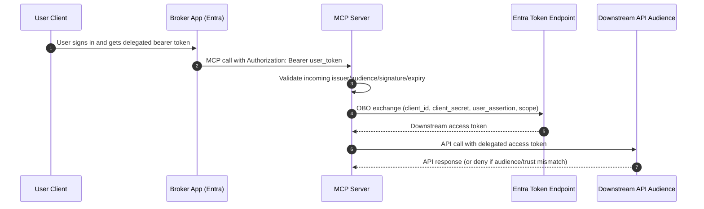
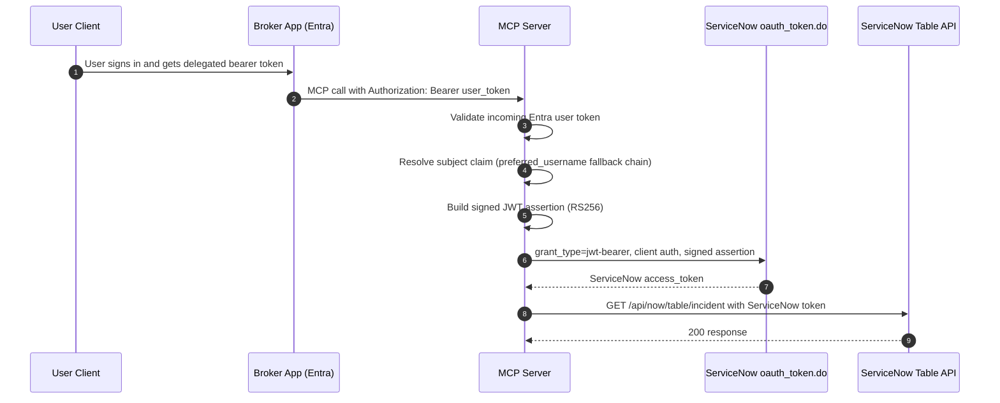

# OBO Flow Options

## Purpose

This document explains the two delegated-access patterns that were used during implementation and live validation:

1. Pattern A: Entra OBO token exchange toward a downstream API audience.
2. Pattern B: ServiceNow OAuth JWT bearer bridge (validated in this tenant).

It also explains why Pattern B worked better in this deployment and what to configure for repeatable success.

## Pattern A: Direct Entra OBO Toward Downstream API

### Summary

In this model, the MCP server receives an incoming user token and performs Entra OBO exchange using broker app credentials. The output token is expected to be accepted by the downstream API audience.

### Flow

### Strengths

- Strong Entra-native delegated model.
- Clear separation of broker and downstream resources.
- Good fit when downstream service directly trusts Entra tokens for that audience.

### Weaknesses in this deployment

- ServiceNow tenant behavior did not reliably accept this as the final delegated access path for API calls.
- SAML-only app paths or mismatched downstream audience contracts produced dead ends.
- Operationally harder when downstream platform token semantics differ from Entra OBO assumptions.

## Pattern B: ServiceNow OAuth JWT Bearer Bridge (Validated)

### Summary

In this model, MCP still validates incoming Entra user identity, but instead of using that token directly against ServiceNow APIs, MCP signs a JWT assertion and exchanges it at ServiceNow oauth_token.do.

ServiceNow then mints a ServiceNow access token for the mapped user.

### Flow

### Strengths

- Works with ServiceNow-native OAuth enforcement.
- Keeps delegated identity checks in MCP while using ServiceNow as final token issuer.
- Tenant-proven in live run: oauth_token.do 200 and table API 200.

### Operational caveats discovered during validation

- The working ServiceNow OAuth client identity was the oauth_jwt client_id in this tenant.
- ServiceNow error messages at oauth_token.do were generic (401/400); syslog was required for root cause.
- ServiceNow user mapping must match the claim used by JWT provider lookup.

## Why Pattern B Works Better Here

Pattern B aligns token minting with the target platform that enforces authorization (ServiceNow).

Direct OBO (Pattern A) assumes downstream audience acceptance semantics that were not consistent in this tenant. Pattern B removes that mismatch by exchanging into a ServiceNow-issued bearer token before API calls.

## Side-by-Side Comparison

| Area | Pattern A: Direct OBO | Pattern B: ServiceNow JWT Bearer |
|---|---|---|
| Final token issuer | Entra | ServiceNow |
| Downstream trust dependency | Downstream must accept Entra delegated token for chosen audience | ServiceNow validates signed assertion and issues native token |
| Tenant-specific complexity | High when audience/enterprise-app semantics diverge | Moderate, mostly in ServiceNow OAuth object mapping |
| Troubleshooting signal | Mostly Entra + downstream auth responses | Requires ServiceNow syslog for precise JWT/token errors |
| Validation status in this repo | Intermittent/blocked path | Fully validated end-to-end |

## Validated ServiceNow JWT Bearer Requirements

1. Use the ServiceNow OAuth client values that actually back the JWT verification path in your tenant.
2. Assertion audience and issuer must match the ServiceNow OAuth object expectations.
3. A ServiceNow sys_user must exist for the resolved user claim.
4. JWT verification key material must be reachable/valid for the configured JWT provider.

## Troubleshooting Map

### 401 access_denied from oauth_token.do

- Check ServiceNow syslog source com.glide.ui.ServletErrorListener.
- Verify client credentials and assertion claim expectations.

### invalid_grant with User not found

- Resolve and inspect incoming Entra claims.
- Ensure matching sys_user exists in ServiceNow for configured user_field mapping.

### invalid_grant with oAuth JWT information not found

- Check JWT provider/client object wiring and issuer/audience semantics.
- Verify JWT signing key and provider lookup constraints.

## Recommended Pattern for this Repository

Use Pattern B as the primary delegated-user model for ServiceNow API access in this tenant.

Keep Pattern A documentation for portability and architecture discussions, but treat Pattern B as the operational default until a tenant demonstrates reliable direct Entra delegated token acceptance for ServiceNow API authorization.
